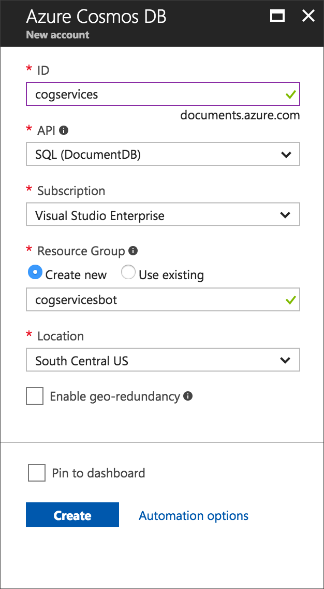
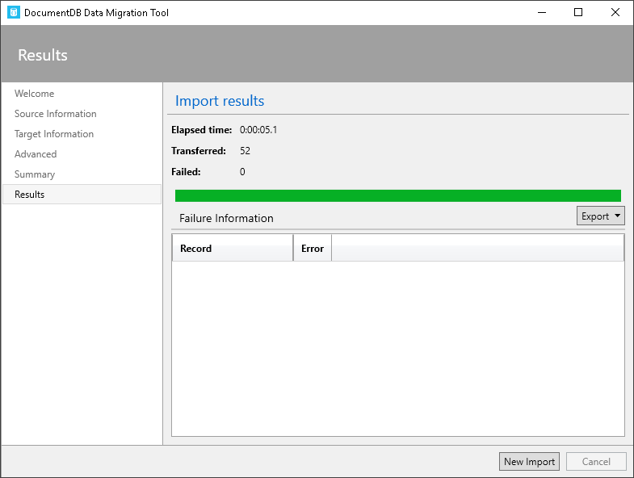

# Cosmos DataBase

## Database Setup - Cosmos DB

Let's start by looking at the CognitiveServices JSON file, found in the data folder of this project. Each `JSON` object is made up of six properties: name, api, category, description, documentation URL and an image URL. 

The goal is to provide a service that allows users to search through or explore the range of Cognitive Services available from Microsoft. The dataset contains a listing of all 29 services, but this approach can easily scale to millions of data points. Azure Search is capable of indexing data from several data sources including Cosmos DB, Blob Storage, Table Storage and Azure SQL.

### Create a Cosmos DB database and collection
For this project we'll be using Cosmos DB for all our data storage.

##### 1. Navigate to Cosmos DB in the Azure Portal

[https://azure.microsoft.com/en-gb/services/cosmos-db/]()

##### 2. Create a Cosmos DB account  
Create a new account with a unique id, in this case I'll be using _'cogservices'_. Select the _'SQL (DocumentDB)'_ API and if needed create a new Resource Group. Then create the Cosmos DB account.

##### 3. Create a new DB (Document DB SQL)  
Click on _Add Collection_ to create a new Database

- Set a fixed storage capacity of 10GB
- Choose the lowest throughput capacity of 400 (Estimated hourly spend $0.032USD)
- Set the database field to 'db'

### Upload JSON data

Now that the database and its collection have been set up its time to upload the `JSON` data. This can be done programatically or we can use the Azure DocumentDB Data Migration Tool (which is documented here [https://azure.microsoft.com/en-us/documentation/articles/documentdb-import-data/](https://azure.microsoft.com/en-us/documentation/articles/documentdb-import-data/))

##### 1. Open the DocumentDB Data Migration Tool
 Once you've downloaded the tool, open the 'dtui.exe' and navigate to the supplied `JSON` data:

##### 2. Get the Upload connection string
Copy the _Primary Connection String_ from the Cosmos DB portal.  

##### 3. Fill in the target information
- Be sure to add `;Database=[YOUR DATABASE ID];` to your connection string. 
- Set the Collection ID field
- Confirm all the settings and upload the `JSON` file

Upload the data.

##### 4. Verify the data
To verify that the data has successfully uploaded, return to the Azure CosmosDB instance and click on the Query Explorer. Running the default Query `SELECT * FROM c` should return all the results present in the database. 

