# LUIS 
## Language Understanding Intelligent Service

### What is LUIS?
Language Understanding Intelligent Service (LUIS) enables developers to build smart applications that can understand human language and react accordingly to user requests. LUIS uses the power of machine learning to solve the difficult problem of extracting meaning from natural language input, so that your application doesn't have to. Any client application that converses with users, like a dialog system or a chat bot, can pass user input to a LUIS app and receive results that provide natural language understanding.

## Key Concepts

**_What is an utterance?_** An utterance is the textual input from the user, that your app needs to interpret. It may be a sentence, like "Book me a ticket to Paris", or a fragment of a sentence, like "Booking" or "Paris flight." Utterances aren't always well-formed, and there can be many utterance variations for a particular intent.

**_What are intents?_** Intents are like verbs in a sentence. An intent represents actions the user wants to perform. It is a purpose or goal expressed in a user's input, such as booking a flight, paying a bill, or finding a news article. You define a set of named intents that correspond to actions users want to take in your application. A travel app may define an intent named "BookFlight", that LUIS extracts from the utterance "Book me a ticket to Paris".

**_What are entities?_** If intents are verbs, then entities are nouns. An entity represents an instance of a class of object that is relevant to a user’s intent. In the utterance "Book me a ticket to Paris", "Paris" is an entity of type location. By recognising the entities that are mentioned in the user’s input, LUIS helps you choose the specific actions to take to fulfil an intent.

## Utilising LUIS
For this demo we're going to use LUIS to interpret the users Utterance and return us the intended recognised Intent. The returned Intent  will contain the Entity that we'll use to trigger our Azure Search functionality.

##### 1. Create a new LUIS application

The first thing we're going to need to do is create a new LUIS app. To do this you'll need to head to [luis.ai](http://www.luis.ai) and sign in with your Microsoft account. Once signed in you'll be able to create a new LUIS app.

Give your app a name and if you wish a description. When selecting an API key we're just going to use the `Bootstrap key` that comes with the LUIS app to get started.

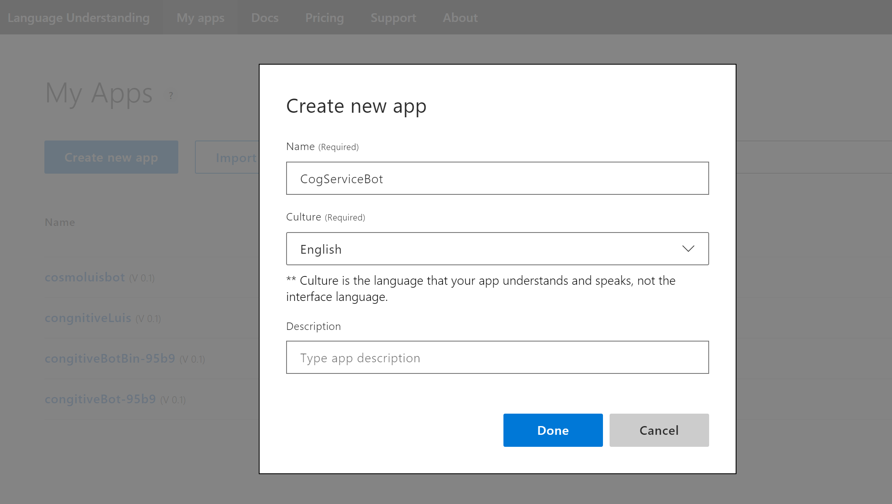

##### 2. Add Entities

Once your app has been created we're going to set up our  entities first so that they are ready when we create our intents. We need two simple entities, one that is associated with products and one for requesting help.

Let's Create two _Simple_ entities. You can use any string name for these, but for our example we're going to use:

`congitiveservice.product`

`congitiveservice.help`

Go to `Build` section and add these entitites.  

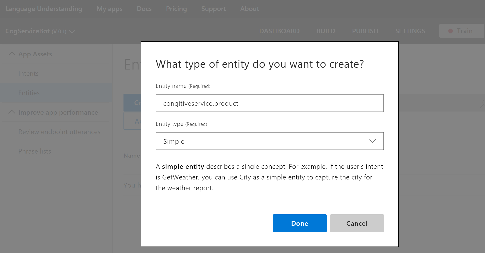

##### 3. Add Intents

Our bot has two main use cases; handling queries about a specific service, or assisting a user explore what the cognitive services offer.

Let's create the two intents Within our LUIS instance. Again, you can use any string name for these, but for our example we're going to use:

`services.search`

`services.help`

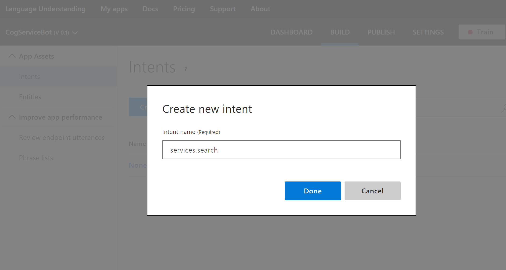

##### 4. Add Utterances

For each intent of our intents we need to add some example utterances that trigger this intent. To ensure that our intent gets matched correctly we should include multiple utterance variations. The more relevant and diverse we add to the intent, the better intent prediction we’ll get from the app.

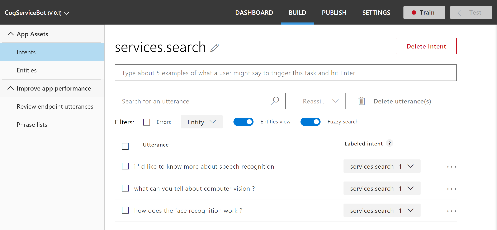

After entering in our utterances we can then identify the entities within the utterance. Simply click on the words within the utterance that you want to mark as being an entity and mark them with the matching entity in the list.

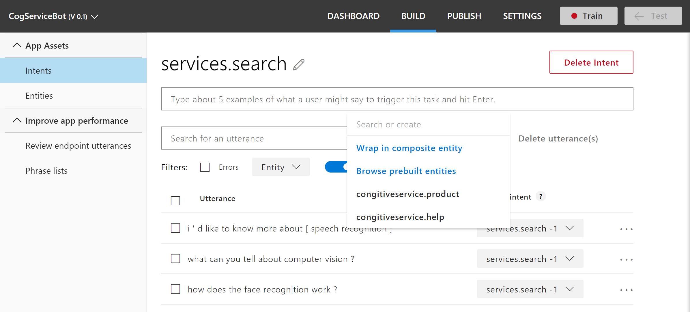

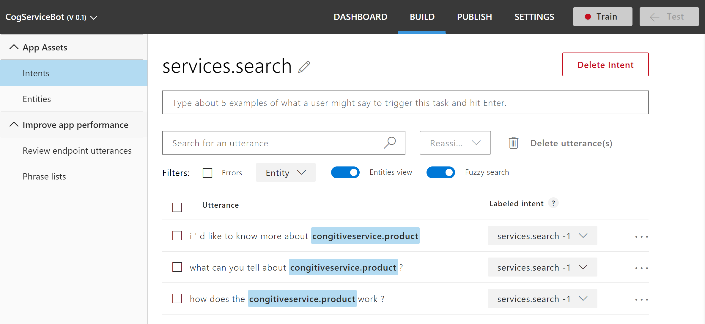

Once we've completed entering in our utterances for the `services.search` intent, we also need to repeat this same process for the `services.help` intent as well.

##### 5. Test and Train your LUIS instance
Whenever updates are made to the current LUIS model, we'll need to train the app before testing and publishing it. When we 'train' a model, LUIS generalises from the labeled examples, and develops code to recognise relevant intents and entities in the future.

Press `Train`  button and wait for some time. LUIS will analyse provided utterances.  

Once our model is trained we can try it out by typing test utterances in the text box to submit them to the app. The results of how the model has interpreted the utterance is displayed below, you're also able to click on previous utterances to review the results.

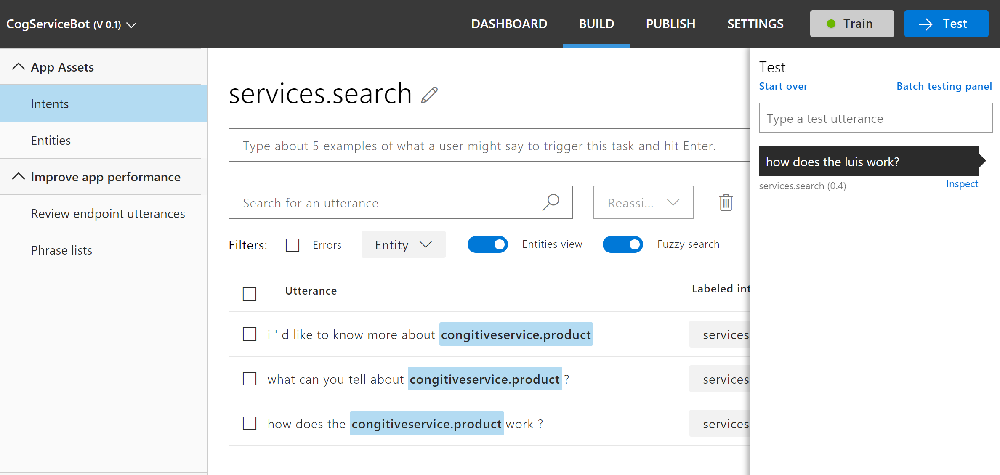

##### 6. Get the ID and key

The next things we're going to need to do is acquire an Endpoint key for LUIS from the Microsoft Azure portal. It is essential for publishing your app and accessing our HTTP endpoint. This key reflects our quota of endpoint hits based on the usage plan you specified while creating the key. For the purpose of our demo we can use the free pricing tier _F0 (5 calls per second, 10k calls per month)_.

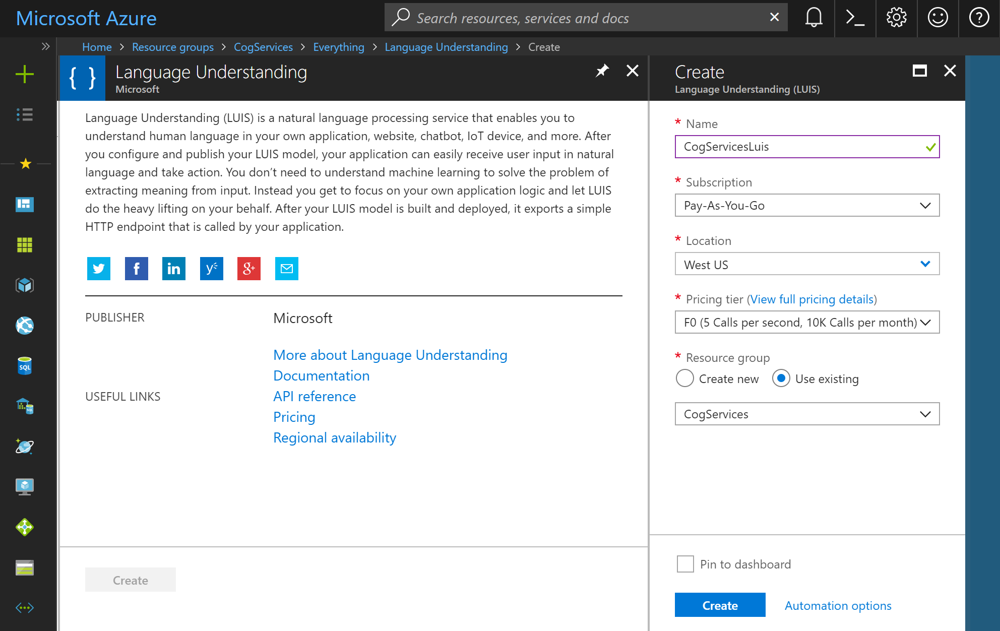

Once the LUIS keys have been set up, copy the first key to your clipboard and return to your LUIS app.

##### 7. Setup Key in LUIS

Head to the _Publish_ tab and add a new key in your LUIS app, paste in your copied key from Azure and give it an appropriate name.  

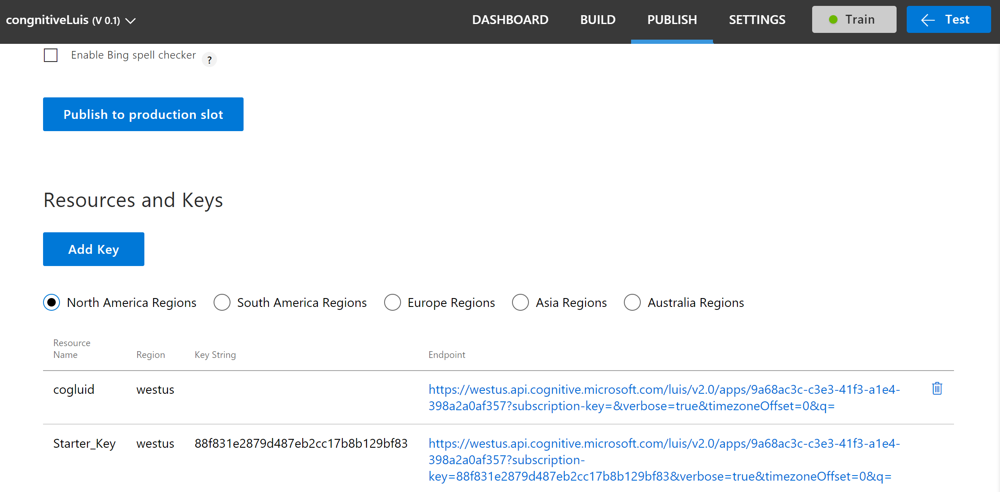  

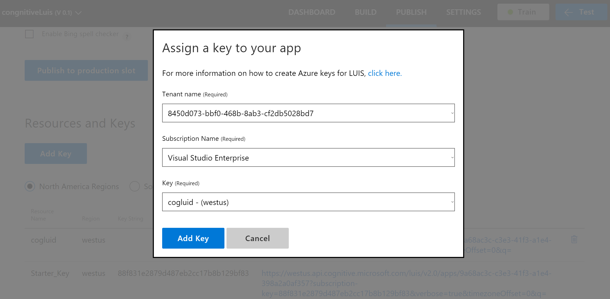

##### 8. Publish your LUIS app
Once the key is all set up we can publish our LUIS app. While you are on _Publish_ tab you can just hit `Publish to production slot` button. Now your LUIS service is published!  

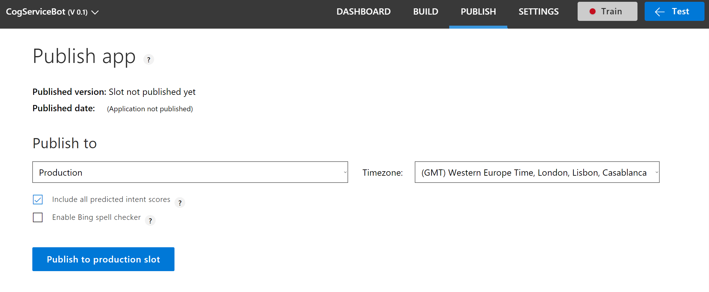
