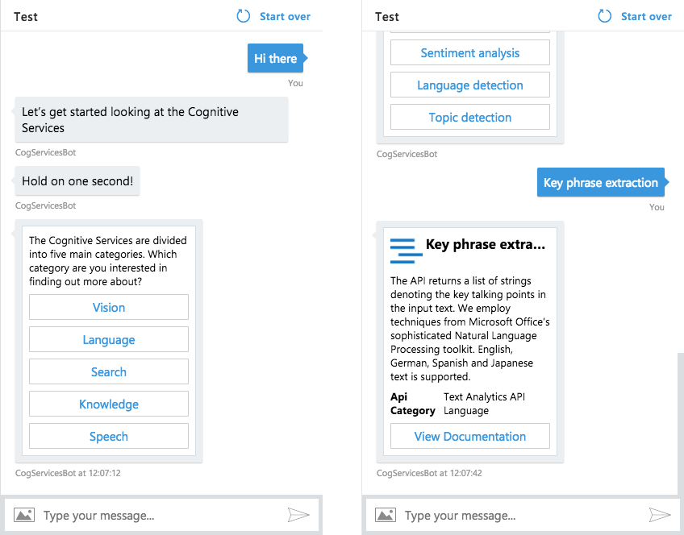

# Using Search to create data driven bots

In this demo look at how to use Azure Cosmos DB, Azure Search and the Microsoft Bot Framework to build a bot that searches and filters over an underlying dataset.

The source for the bot has been written in C#. If you'd like to explore `Node.js` specific examples there are plenty of alternate projects available from Microsoft's BotBuilder Github account [here](https://github.com/Microsoft/BotBuilder-Samples).

## Setup: Accounts & Subscriptions

To get started, you’ll need to create/login to a few accounts. (don’t worry, they’re all free)

### Microsoft Azure

We’ll be using Azure Bot Service, so you’ll need an Azure account. If you don’t already have one, you can create a free Azure account [here](https://azure.microsoft.com/free/).

### Microsoft Bot Framework

[Create or login](https://dev.botframework.com/identity/signin?requestUrl=%2F) to your [Microsoft Bot Framework](https://dev.botframework.com/) account. Even if you already have an account, make sure to login, as it’ll simplify setting up your bot in Azure.

# Chapters

Each of the chapters provides step by step instructions on getting each service configured for the final Bot project.

1. [CosmosDB](CosmosDB.md)
2. [Azure Search](AzureSearch.md)
3. [Azure Storage](AzureStorage.md)
4. [LUIS](LUIS.md)
5. [The Bot](Bot.md)
6. [Configuring the Bot](BotConfigure.md)

# Summary

After following the guide you'll have your own custom search bot set up. You can easily add additional channels for users to communicate with the bot. Try configuring the bot with a number of different channels to see how the bot behaves from the users point of view.

# Authors
- Clint Francis - [Github](https://github.com/clintfrancis)
