# Using Search to create data driven bots

In this demo look at how to use Azure Cosmos DB, Azure Search and the Microsoft Bot Framework to build a bot that searches and filters over an underlying dataset.

The source for the bot has been written in C#. If you'd like to explore Node.js specific examples there are plenty of alternate projects available from Microsoft's BotBuilder Github account [here](https://github.com/Microsoft/BotBuilder-Samples).

## Setup: Accounts & Subscriptions

To get started, you’ll need to create/login to a few accounts. (don’t worry, they’re all free)

### Microsoft Azure

We’ll be using Azure Bot Service, so you’ll need an Azure account. If you don’t already have one, you can create a free Azure account [here](https://azure.microsoft.com/free/).

### Microsoft Bot Framework

[Create or login](https://dev.botframework.com/login?requestUrl=%2F) to your [Microsoft Bot Framework](https://dev.botframework.com/) account. Even if you already have an account, make sure to login, as it’ll simplify setting up your bot in Azure.

## Services Used

- CosmosDB
- Azure Search
- Azure Storage
- LUIS
- Bot Framework

***

# Cosmos DataBase

## Database Setup - Cosmos DB

Let's start by looking at the CognitiveServices JSON file, found in the data folder of this project. Each `JSON` object is made up of six properties: name, api, category, description, documentation URL and an image URL. 

The goal is to provide a service that allows users to search through or explore the range of Cognitive Services available from Microsoft. The dataset contains a listing of all 29 services, but this approach can easily scale to millions of data points. Azure Search is capable of indexing data from several data sources including Cosmos DB, Blob Storage, Table Storage and Azure SQL.

### Create a Cosmos DB database and collection
For this project we'll be using Cosmos DB for all our data storage.

##### 1. Navigate to Cosmos DB in the Azure Portal

[https://azure.microsoft.com/en-gb/services/cosmos-db/]()


##### 2. Create a Cosmos DB account  
Create a new account with a unique id, in this case I'll be using _'cogservices'_. Select the _'SQL (DocumentDB)'_ API and if needed create a new Resource Group. Then create the Cosmos DB account.


##### 3. Create a new DB (Document DB SQL)  
Click on _Add Collection_ to create a new Database


- Set a fixed storage capacity of 10GB
- Choose the lowest throughput capacity of 400 (Estimated hourly spend $0.032USD)
- Set the database field to 'db'


### Upload JSON data

Now that the database and its collection have been set up its time to upload the `JSON` data. This can be done programatically or we can use the Azure DocumentDB Data Migration Tool (which is documented here [https://azure.microsoft.com/en-us/documentation/articles/documentdb-import-data/](https://azure.microsoft.com/en-us/documentation/articles/documentdb-import-data/))

##### 1. Open the DocumentDB Data Migration Tool
 Once you've downloaded the tool, open the 'dtui.exe' and navigate to the supplied `JSON` data:


##### 2. Get the Upload connection string
Copy the _Primary Connection String_ from the Cosmos DB portal.  


##### 3. Fill in the target information
- Be sure to add `;Database=[YOUR DATABASE ID];` to your connection string. 
- Set the Collection ID field
- Confirm all the settings and upload the `JSON` file


Upload the data.


##### 4. Verify the data
To verify that the data has successfully uploaded, return to the Azure CosmosDB instance and click on the Query Explorer. Running the default Query `SELECT * FROM c` should return all the results present in the database. 


***

# Azure Search

##### 1. Create the Azure Search
Create the new Search Service and assign it to the same resource group.

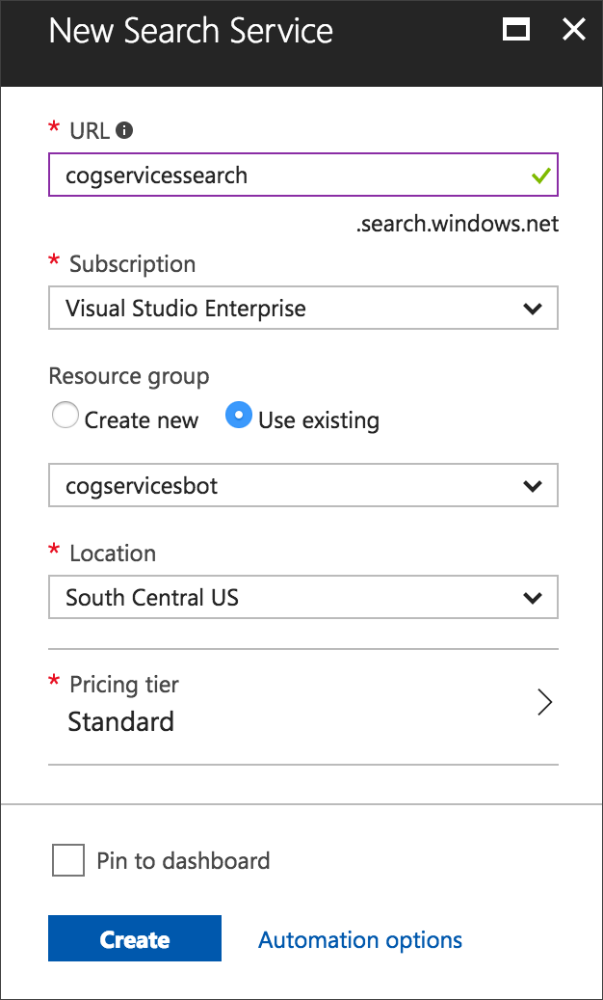

##### 2. Import data into the Search Service.
- Once the Search Service has been created. Click on 'Import Data'.

- When prompted to select a data source choose 'DocumentDB' and select an account select the DocumentDB account we created earlier.


##### Create your Azure Search Index
Here's where the magic starts to happen. You can see that Azure Search has accessed our data and pulled in each parameter of the `JSON` objects. Now we get to decide which of these parameters we want to search over, facet over, filter by and retrieve. Again we could generate our indices programatically, and in more complex use cases we would, but for the sake of simplicity we'll stick to the portal UI. Given that we want access to all of these properties we'll go ahead and make them all retrievable. We want to be able to facet (more details about faceting to come) and filter over Categories. Finally, we'll mark `name`, `api`, `category` and `description` as searchable so that our bot can search using general terms.


##### 4. Create the Azure Search indexer
As our data is subject to change, we need to be able to reindex that data. Azure Search allows you to index on a schedule or on demand, but for this demo we'll index once only.


##### 5. Use the Search Explorer

We can verify that our index is properly functioning by using the Azure Search Explorer to enter example searches, filters and facets. This can be a very useful tool in testing out queries as you develop your bot. _Note: If you enter a blank query the explorer should return all of your data_.

Let's try three different queries:

`Face`

Given that our index searches over the different Cognitive Services, a search of "Face" returns all the relevant entries information associated with the Face API along with a search score. The search score represents the confidence that Azure Search has regarding each result.


`facet=Category`

Faceting allows us to see the different examples of a parameter and their corresponding counts. You can see here that the JSON response from the search API tells us the number of Vision, Speech, Language, Knowledge, and Search APIs available.


This information will allow us to guide the conversation our bot can have. If a user wishes to see Cognitive Services by category, our bot can quickly and efficiently find all the Cognitive Services that are available within a category and present them as options to the user.

`$filter=Category eq 'Speech'`


***

# Storage
## Blob Storage
Navigate to the Azure portal and create a new Storage account.


##### Create a new Container
Create a new container named _images_ and set its public access level to _Blob_


##### Upload the images

We're going to use the Storage Explorer to upload our image assets to the newly created Storage Container.
 If you don’t have the Storage Explorer app yet, download it from [storageexplorer.com](https://azure.microsoft.com/en-us/features/storage-explorer/).
 
After authenticating with the Storage Explorer you'll be able to browse to the target container in the new Storage account.
 


Upload all the images in the `resources\images` folder to the target container, then head back to the Azure portal to verify them.


##### Get the Container URL

Now we need to make a note of the Storage Container's URL. Click on _Properties_ and copy the URL to your clipboard - paste it somewhere easy to get hold of for now.

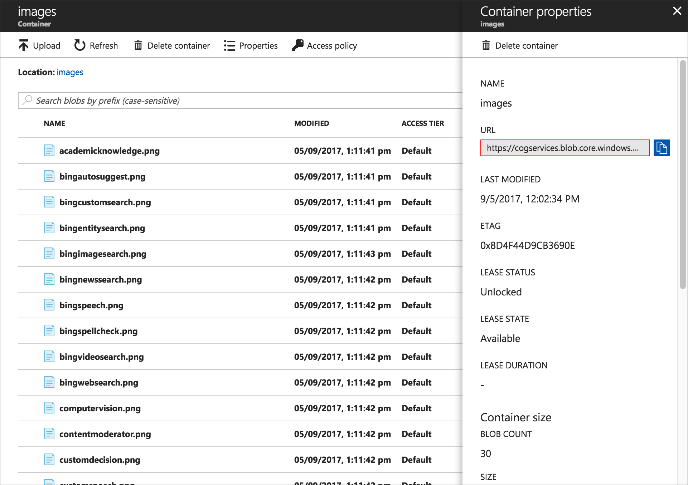

***

# LUIS 
## Language Understanding Intelligent Service

### What is LUIS?
Language Understanding Intelligent Service (LUIS) enables developers to build smart applications that can understand human language and react accordingly to user requests. LUIS uses the power of machine learning to solve the difficult problem of extracting meaning from natural language input, so that your application doesn't have to. Any client application that converses with users, like a dialog system or a chat bot, can pass user input to a LUIS app and receive results that provide natural language understanding.

## Key Concepts

**_What is an utterance?_** An utterance is the textual input from the user, that your app needs to interpret. It may be a sentence, like "Book me a ticket to Paris", or a fragment of a sentence, like "Booking" or "Paris flight." Utterances aren't always well-formed, and there can be many utterance variations for a particular intent.

**_What are intents?_** Intents are like verbs in a sentence. An intent represents actions the user wants to perform. It is a purpose or goal expressed in a user's input, such as booking a flight, paying a bill, or finding a news article. You define a set of named intents that correspond to actions users want to take in your application. A travel app may define an intent named "BookFlight", that LUIS extracts from the utterance "Book me a ticket to Paris".

**_What are entities?_** If intents are verbs, then entities are nouns. An entity represents an instance of a class of object that is relevant to a user’s intent. In the utterance "Book me a ticket to Paris", "Paris" is an entity of type location. By recognising the entities that are mentioned in the user’s input, LUIS helps you choose the specific actions to take to fulfil an intent.

## Utilising LUIS
For this demo we're going to use LUIS to interpret the users Utterance and return us the intended recognised Intent. The returned Intent  will contain the Entity that we'll use to trigger our Azure Search functionality.


##### 1. Create a new LUIS application

The first thing we're going to need to do is create a new LUIS app. To do this you'll need to head to [luis.ai](http://www.luis.ai) and sign in with your Microsoft account. Once signed in you'll be able to create a new LUIS app.

Give your app a name and if you wish a description. When selecting an API key we're just going to use the `Bootstrap key` that comes with the LUIS app to get started.


##### 2. Add Entities

Once your app has been created we're going to set up our  entities first so that they are ready when we create our intents. We need two simple entities, one that is associated with products and one for requesting help.

Let's Create two _Simple_ entities. You can use any string name for these, but for our example we're going to use:

`congitiveservice.product`

`congitiveservice.help`


##### 3. Add Intents

Our bot has two main use cases; handling queries about a specific service, or assisting a user explore what the cognitive services offer.

Let's create the two intents Within our LUIS instance. Again, you can use any string name for these, but for our example we're going to use:

`services.search`

`services.help`


##### 4. Add Utterances

For each intent of our intents we need to add some example utterances that trigger this intent. To ensure that our intent gets matched correctly we should include multiple utterance variations. The more relevant and diverse we add to the intent, the better intent prediction we’ll get from the app.


After entering in our utterances we can then identify the entities within the utterance. Simply click on the words within the utterance that you want to mark as being an entity and mark them with the matching entity in the list.


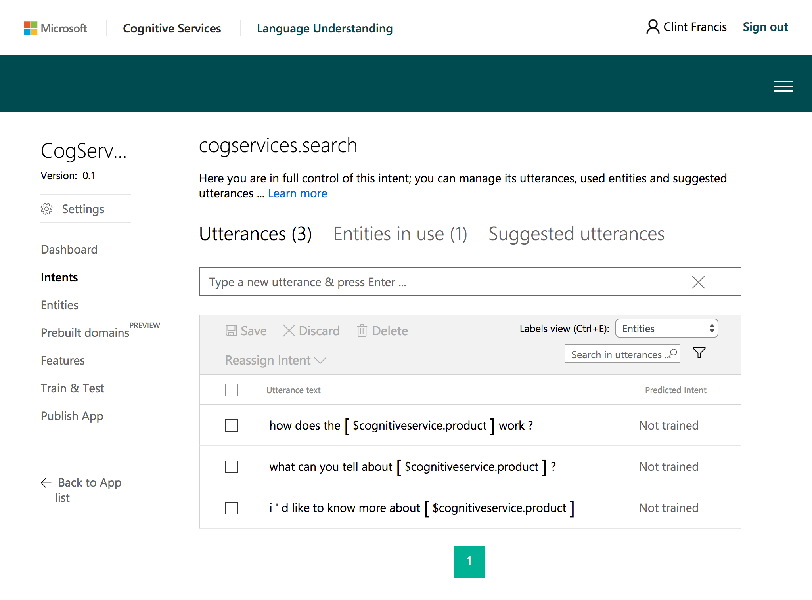

Once we've completed entering in our utterances for the `services.search` intent, we also need to repeat this same process for the `services.help` intent as well.

##### 5. Test and Train your LUIS instance
Whenever updates are made to the current LUIS model, we'll need to train the app before testing and publishing it. When we 'train' a model, LUIS generalises from the labeled examples, and develops code to recognise relevant intents and entities in the future.


Once our model is trained we can try it out by typing test utterances in the text box to submit them to the app. The results of how the model has interpreted the utterance is displayed below, you're also able to click on previous utterances to review the results.

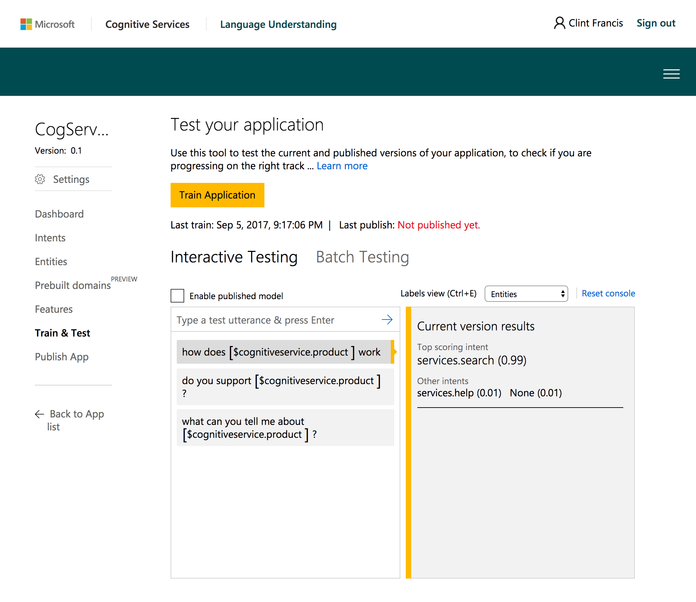

##### 6. Get the ID and key

The next things we're going to need to do is acquire an Endpoint key for LUIS from the Microsoft Azure portal. It is essential for publishing your app and accessing our HTTP endpoint. This key reflects our quota of endpoint hits based on the usage plan you specified while creating the key. For the purpose of our demo we can use the free pricing tier _F0 (5 calls per second, 10k calls per month)_.


Once the LUIS keys have been set up, copy the first key to your clipboard and return to your LUIS app.


##### 7. Setup Key in LUIS

Add a new key in your LUIS app, paste in your copied key from Azure and give it an appropriate name.


##### 8. Publish your LUIS app
Once the key is all set up we can publish our LUIS app. Head to the _Publish App_ tab and select your newly created Endpoint Key, then go ahead and hit Publish!

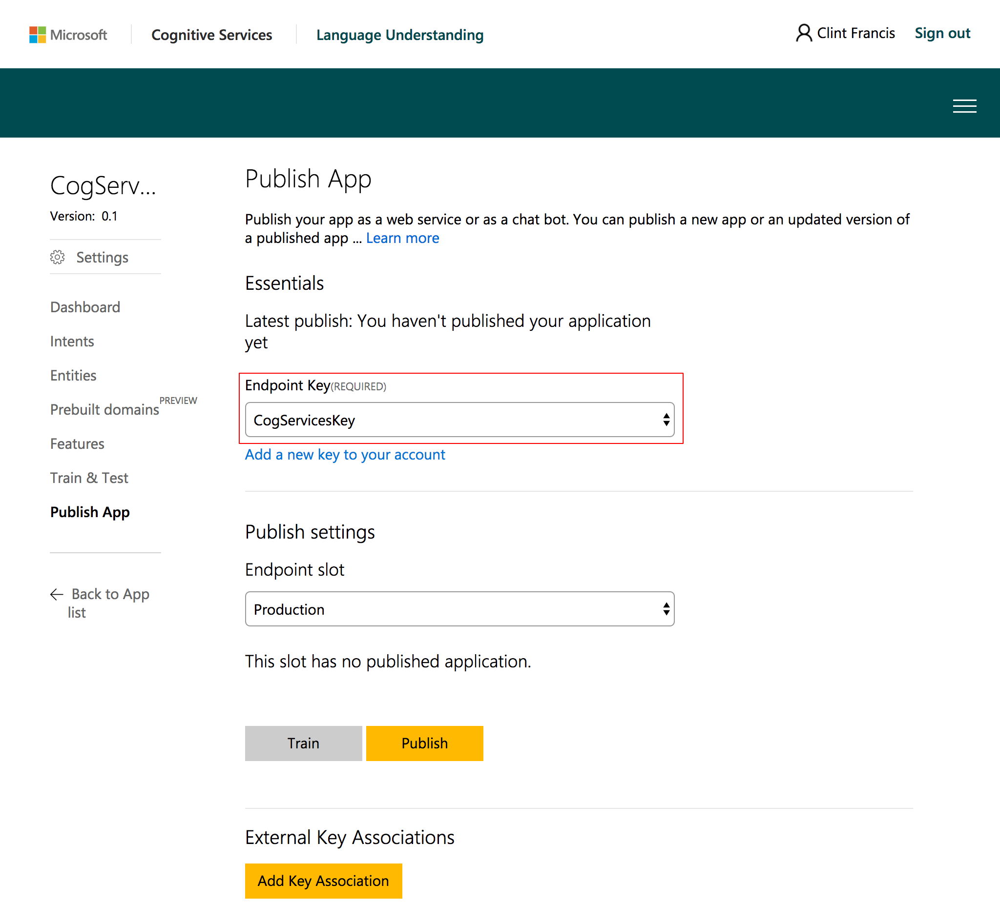


***

# The Bot

## Exploring the Solution

The source for the bot has been written in C#. If you'd like to explore Node.js specific examples there are plenty of alternate projects available from Microsoft's BotBuilder Github account [here](https://github.com/Microsoft/BotBuilder-Samples).

The source for this example provides everything you need to demo a working bot and if you want to you can get started straight away by populating the required keys found in the Bot Configuration section.  

Here's what we'll cover as part of this bot:

- Services and models
- Message Control
- Dialogs
- Scorable Dialogs
- Rich Cards

***
## Services And Models
The first thing we'll look at with the project is how the Services and models have been set up.

#### AzureSearchService
The `AzureSearchService` class simply provides us with a group of methods to access our CosmosDB data via the Azure Search Service. For the most part these methods are provide us with a way of searching for different items, but we've also implemented a `FetchFacets` method to return a list of all the available categories in our database.

The other methods to note are:

```
public async Task<string> CheckCategoryExists(string value)
```

```
public async Task<string> CheckAPIExists(string value}
```

Both of these methods perform a fuzzy search and return a _corrected_ value if matched. This just ensures that when replying to the user we use the corrected search term to indicate the correct name. For example _'commuter vision'_ will be corrected to _'Computer Vision'_.

#### ProductModel
The `ProductModel` class is used to track a users search history during an active `Dialog` with the bot. Its a straight forward model that contains two static helper methods to set and clear the data associated with the current state.

State data can be used for many purposes, such as determining where the prior conversation left off or simply greeting a returning user by name. In this case I'm storing the history of a users query. You can read more about how to use state data [here](https://docs.microsoft.com/en-us/bot-framework/dotnet/bot-builder-dotnet-state).


## Message Control
The first class we're going to take a look at is the `MessagesController.cs`. The `MessagesController` is the main contact point with the bot's users, more specifically the Post method handles incoming messages from the end user as well as replying to them.

When the bot receives an activity from the user, it checks to see what type of activity it is, then acts accordingly. There are various [activity types](https://docs.microsoft.com/en-us/bot-framework/dotnet/bot-builder-dotnet-activities) built into the bot framework:

- _Message_ - Messages are the core type of interaction between Bot and the end users. These can be anything from simple text to complex interactions with UI elements.
- _DeleteUserData_ - Indicates to a bot that a user has requested that the bot delete any user data it may have stored.
- ConversationUpdate - Indicates that the bot was added to a conversation, other members were added to or removed from the conversation, or conversation metadata has changed.
- ContactRelationUpdate - Indicates that the bot was added or removed from a user's contact list.
- Typing - Indicates that the user or bot on the other end of the conversation is compiling a response.
- Ping - Represents an attempt to determine whether a bot's endpoint is accessible.

When an `Activity` is sent to the `Post` method, we check the type and forward it to the right handler.
 
```
public async Task<HttpResponseMessage> Post([FromBody]Activity activity)
{
	if (activity.Type == ActivityTypes.Message)
	{
		await Conversation.SendAsync(activity, MakeRoot);
	}
	else
	{
		HandleSystemMessage(activity);
	}
	var response = Request.CreateResponse(HttpStatusCode.OK);
	return response;
}
```  

Any activities with the type `Message` are routed to the `MakeRoot` method which generates a new instance of the `DefaultDialog.cs` class. Ordinarily you could just send the activity to a new `IDialog` instance directly, but the `DefaultDialog` class inherits from `LuisDialog` so we need to instance it differently.

```
internal static IDialog<object> MakeRoot()
{
	return Chain.From(() => new DefaultDialog());
}
```


## Default Dialog

The `DefaultDialog` class handles all of our LUIS interactions with the user so we're going to focus on it in detail. The first thing to point out is that this `Dialog` inherits from `LuisDialog` which allows LUIS to trigger methods that match its intents directly. 

```
[LuisModel("[LUIS_APP_ID]", "[LUIS_SERVICE_KEY]", domain: "[LUIS_DOMAIN]")]
[Serializable]
public class DefaultDialog:LuisDialog<object>
```

#### Methods for each LUIS intent on our LUIS model
Each of the LUIS intents is matched to a different method, using the `LuisIntent` attribute for identification.

### None
If we can't find a match to the users utterance then this method will handle replying to the user.

```
[LuisIntent("None")]
public async Task None(IDialogContext context, IAwaitable<IMessageActivity> message, LuisResult result)
{
    string response = $"Sorry I did not understand: " + string.Join(", ", result.Intents.Select(i => i.Intent));
    await context.PostAsync(response);
}
```

### services.search
When LUIS matches a users intent with a service search this method will handle the dialog. As this function has a lot going on let's break it down piece by piece.

This method will handle all of our `services.search` intents that are recognised by LUIS. The method has been marked with a LuisIntent attribute that declares the specific intent registered in our LUIS app.

```
[LuisIntent("services.search")]
public async Task SearchService(IDialogContext context, IAwaitable<IMessageActivity> message, LuisResult result)
```

The first thing that we do after receiving the incoming `LuisResult` is to check if there are any identified _product_ entities.

```
var messageToForward = await message;

EntityRecommendation productSearch;
if (result.TryFindEntity(ServiceEntities.Product, out productSearch))
{ ...
```

If there are any `cognitiveservice.product` entities present in the `LuisResult` we want to qualify what the user is searching for.

We retrieve the ProductModel from the current conversation context (If one doesn't exist a new one will be created). For consistency the `SearchTerm` is also converted to title case.

```
var model = ProductModel.GetContextData(context);
// Title case the search entity for consistency
model.SearchTerm = new CultureInfo("en").TextInfo.ToTitleCase(productSearch.Entity.ToLower());
```

To help narrow down the scope of a users request, If the`Result.Query` contains either _api_ or _category_ we use the `searchService.CheckAPIExists()` or `searchService.CheckCategoryExists()` methods to validate that the entity exists and if necessary return the correct name. 

The corrected value is stored in the `ProductModel` so we can keep track of the users intention when the `context` is passed through to another dialog. 

```
// Are we searching for an API?
string query = result.Query.ToLower();
if (query.Contains("api"))
{
	var matchedAPI = await searchService.CheckAPIExists(model.SearchTerm);
	if (!string.IsNullOrEmpty(matchedAPI))
		model.API = model.SearchTerm = matchedAPI;
}

// Are we searching for a Category?
else if (query.Contains("category"))
{
	var matchedCategory = await searchService.CheckCategoryExists(model.SearchTerm);
	if (!string.IsNullOrEmpty(matchedCategory))
		model.Category =  model.SearchTerm = matchedCategory;
}
```

The user is then notified that we're starting the search and
the `context` is forwarded on to a new dialog - in this case the `ServiceSearchDialog`. 

You'll note that one of the arguments provided is called `AfterDialog`. This is the method we return to _after_ the new dialog on the stack has been completed. It's important that we close out each `Dialog` instance as it completes to pop it off the `Dialog` stack.

```
// Is this a general product search?
ProductModel.SetContextData(context, model);

await context.PostAsync($"Ok, let me look for information on '{model.SearchTerm}'.");
await context.Forward(new ServiceSearchDialog(), AfterDialog, messageToForward, CancellationToken.None);
```

```
private async Task AfterDialog(IDialogContext context, IAwaitable<object> result)
{
	var messageHandled = await result;
	ProductModel.ClearContextData(context);
	context.Done<object>(null);
}
```


Lastly, if we were unable to find a `cognitiveservice.product` entity in the `LuisResult` we forward the context to the `ServiceExploreDialog` which will guide the user in finding the information they want.
	
```
// If we cant identify a product entity, start an explore dialog
else
{
    await context.PostAsync("let's explore what you can do with the Cognitive Services.");
	await context.Forward(new ServiceExploreDialog(), AfterDialog, messageToForward, CancellationToken.None);
}
```

### services.help
When LUIS matches a users Intent with a request for help this method will handle the context. This method simply let's the user know that we've received their query before we forward the context on to the `ServiceExploreDialog` to guide the user in their search.

```
[LuisIntent("services.help")]
public async Task RequestHelp(IDialogContext context, IAwaitable<IMessageActivity> message, LuisResult result)
{
	var messageToForward = await message;

	await context.PostAsync("Let's get started looking at the Cognitive Services");
	await context.PostAsync("Hold on one second!");

	await context.Forward(new ServiceExploreDialog(), AfterDialog, messageToForward, CancellationToken.None);
}
```

### ServiceSearchDialog

The `ServiceSearchDialog` is a standard `IDialog<object>` instance. This class contains three methods:

#### `StartAsync`
The `StartAsync` method is required as part of an `IDialog` instance. We're simply waiting for the message to arrive, which is then forwarded on the the `MessageRecievedAsync` method.

```
public async Task StartAsync(IDialogContext context)
{
	context.Wait(this.MessageReceivedAsync);
}
```

#### `MessageReceivedAsync`
The `MessageReceivedAsync` method is where we handle all our search logic, so lets look at it in detail.

```
public virtual async Task MessageReceivedAsync(IDialogContext context, IAwaitable<IMessageActivity> result)
```

We check whether we already have an _api_ or _category_ set in the `ProductModel`. If we do, we message the user that we have found something for them and then forward the `context` on to a new instance of the `ServiceExploreDialog` class. This means that if the user is interested in a specific _api_ they can be routed directly to the _api_ Dialog.

```
var model = ProductModel.GetContextData(context);

if(!string.IsNullOrEmpty(model.API) || !string.IsNullOrEmpty(model.Category))
{
	await context.PostAsync($"I've found some information on '{model.SearchTerm}'");

	ProductModel.SetContextData(context, model);
	await context.Forward(new ServiceExploreDialog(), AfterDialog, messageToForward, CancellationToken.None);
}
``` 

If there isn't an _api_ or _category_ present in the `ProductModel` we perform a general search using the supplied `SearchTerm`. The results of the search are then returned to the user as a carousel of custom `AdaptiveCard` views. These `AdaptiveCard` views are created using the `CardUtil.CreateFeatureCard(Value value)` util method which we'll look at these in more detail soon.

Note that at the end of each branch in the logic we're calling `context.Done<object>(null)` to close the `Dialog` and remove it from the stack. If you forget to signal that you're done with the `context` then the user will get stuck in the same `IDialog` instance. 

```
else
{
	var results = await searchService.Search(model.SearchTerm);

	if (results.value.Length > 0)
	{
		List<Attachment> attachments = new List<Attachment>();
		for (int i = 0; i < results.value.Length; i++)
		{
			Attachment attachment = new Attachment()
			{
				ContentType = AdaptiveCard.ContentType,
				Content = CardUtil.CreateFeatureCard(results.value[i])
			};
			attachments.Add(attachment);
		}

		var reply = context.MakeMessage();
		reply.AttachmentLayout = AttachmentLayoutTypes.Carousel;
		reply.Attachments = attachments;

		await context.PostAsync(reply);

		context.Done<object>(null);
	}
	else
	{
		await context.PostAsync($"Sorry! I couldnt find anything that matched the search '{model.SearchTerm}'");
		context.Done<object>(null);
	}
}
```

#### `AfterDialog`

The `AfterDialog` method ensures that we signal that we are done with the `context` once any child `IDialog` instances complete. If there's a message passed back, we make sure thats passed on as well before this `IDialog` is closed. 

```
private async Task AfterDialog(IDialogContext context, IAwaitable<object> result)
{
	var messageHandled = (string)await result;

	if (!string.IsNullOrEmpty(messageHandled))
	{
		context.Done(messageHandled);
	}
	else
	{
		context.Done<object>(null);
	}
}
```

### ServiceExploreDialog

The `ServiceExploreDialog` class simply guides the user through a decision hierarchy going from: _Category > Api > Feature_. 

Once we determine which step a user is at in their search we forward the `context` on the the appropriate `IDialog` for move down the hierarchy to the information they're looking for.

```
public virtual async Task MessageReceivedAsync(IDialogContext context, IAwaitable<IMessageActivity> result)
{
	var messageToForward = await result;

	var model = ProductModel.GetContextData(context);
	if (!string.IsNullOrEmpty(model.API))
	{
		await context.Forward(new ChooseFeatureDialog(), AfterFeatureDialog, messageToForward, CancellationToken.None);
	}

	else if(!string.IsNullOrEmpty(model.Category))
	{
		await context.Forward(new ChooseAPIDialog(), AfterCategoryDialog, messageToForward, CancellationToken.None);
	}

	else
	{
		await context.Forward(new ChooseCategoryDialog(), AfterCategoryDialog, messageToForward, CancellationToken.None);
	}
}
```

We also have four follow up handlers declared:
`AfterCategoryDialog`, `AfterAPIDialog`, `AfterFeatureDialog` and `AfterFeatureDisplayDialog`. Each of these methods passes the user to the next step which will be one of the four granular dialogs. 

The full explore pattern is:

```
> ChooseCategoryDialog
	> [AfterCategoryDialog]
		> ChooseAPIDialog
			> [AfterAPIDialog]
				> ChooseFeatureDialog
					> [AfterFeatureDialog]
						> DisplayFeaturesDialog
							> [AfterFeatureDisplayDialog]
```


### Granular Dialogs
The four "Granular Dialog" classes are used to prompt the user are used prompt the user to make a choice and / or display search results. By separating each of these steps out into their own `IDialog` classes we're able to easily route the user directly into any stage of the conversation giving us greater flexibility. Take a look through each of the classes to get a sense of how they operate.

- `ChooseCategoryDialog`
- `ChooseAPIDialog`
- `ChooseFeatureDialog`
- `DisplayFeaturesDialog`

### Scorable Dialogs

Scorable dialogs act like global message handlers. When users attempt to access certain functionality within a bot by using words like "help," "cancel," or "start over" in the middle of a conversation - the bot is expecting a different response. Scorable dialogs allow the bot to gracefully handle these requests.

Scorable dialogs monitor all incoming messages and determine whether a message is actionable in some way. Messages that are scorable are assigned a score between [0 – 1] by each scorable dialog. 

The scorable dialog that determines the highest score is added to the top of the dialog stack and then hands the response to the user. After the scorable dialog completes execution, the conversation continues from where it left off.

In this bot we're using a single scorable dialog `CancelScorable` to cancel our current dialog and restart. When the user enters 'cancel' we reset the dialog stack and the `ProductModel` to start again.

There's a lot of information on using scorable dialogs available to read here:
[https://docs.microsoft.com/en-us/bot-framework/dotnet/bot-builder-dotnet-scorable-dialogs](https://docs.microsoft.com/en-us/bot-framework/dotnet/bot-builder-dotnet-scorable-dialogs)

### Rich Cards

Bots and channels typically exchange text strings but some channels also support exchanging attachments, which lets your bot send richer messages to users. 

We're going to use rich cards to return our _service_ results to the user within our app. Using the `CardUtil` class we can generate a rich card that is specific to the users channel (Slack, Skype, etc).

```
public static Attachment CreateCardAttachment(string channelID, Value value)
```

This project currently supports two types of rich cards `ThumbNail` and `Adaptive`. Skype doesn't currently offer support for Adaptive Cards, so we're opting to use a Thumbnail card instead if the user is messaging using Skype.

#### Thumbnail Card

Thumbnail cards typically contain a single thumbnail image, one or more buttons, and text. 

#### Adaptive Card

Adaptive Cards are an open card exchange format enabling developers to exchange UI content in a common and consistent way across multiple channels. 

While the Adaptive Card in this project is build using code you can also use a `json` file to declare a cards layout.

Check out [adaptivecards.io](http://adaptivecards.io/) for more information on how to use and create Adaptive Cards.


***

# Bot Configuration

To get started using the Bot straight away within our local environment, we need to configure the source with the credentials from the services we've created.

## WebConfig
The first file we need to update is `WebConfig` which you can find in the root of the source folder. Here we're going to set the following properties: `SearchName`, `IndexName`, `SearchKey`, `BlobStorageURL`.

```
<appSettings>
    ...
    <add key="SearchName" value="[SEARCH_NAME]" />
    <add key="IndexName" value="[SEARCH_INDEX]" />
    <add key="SearchKey" value="[SEARCH_KEY]" />
    <add key="BlobStorageURL" value ="[STORAGE_URL}" />
  </appSettings>
```

### Azure Search

The `SearchName` and `IndexName` values can be found in the Azure Portal on the overview page for our Search Service.

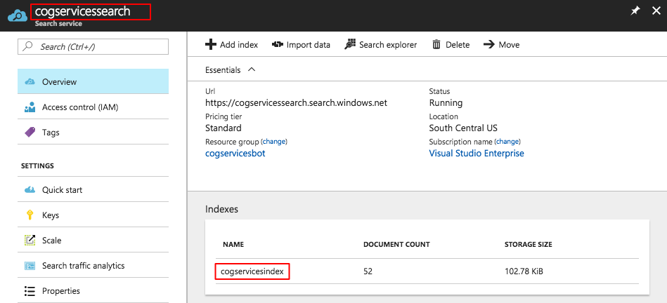

The `SearchKey` can be found on the _Keys_ tab of the Search Service page under the _Manage query keys_ link.


### Azure Storage
The get the `BlobStorageURL` navigate to your Azure Storage instance in Azure and click on the images container we made earlier. From within the images container you can click on _Container properties_ to locate the target URL we need for the `BlobStorageURL` value in the WebService file. 

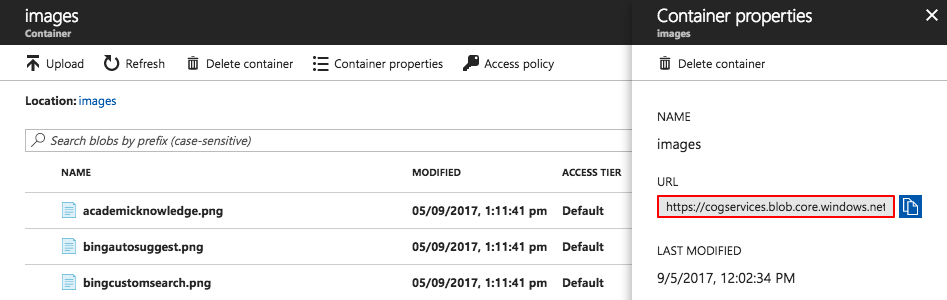


## DefaultDialog
The `DefaultDialog` class is the main class we use to handle our LUIS queries. The class attributes need to updated reflect the LUIS app id, service key and hosted domain.

```
[LuisModel("[LUIS_APP_ID]", "[LUIS_SERVICE_KEY]", domain: "[LUIS_DOMAIN]")]
[Serializable]
public class DefaultDialog:LuisDialog<object>
{
	...
}
```


### LUIS App ID

The `LUIS_APP_ID` can be obtained from the dashboard of your LUIS app at [Luis.ai](https://www.luis.ai/).

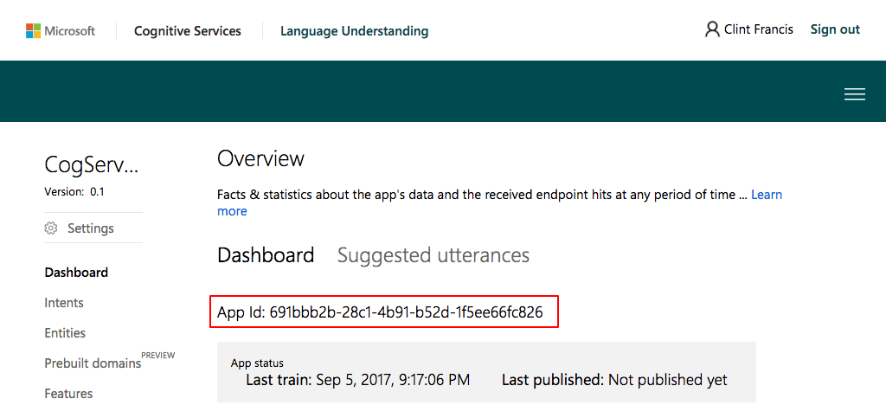

### LUIS Service Key

The `LUIS_SERVICE_KEY` Can be obtained from the Keys tab of your LUIS service in Azure.

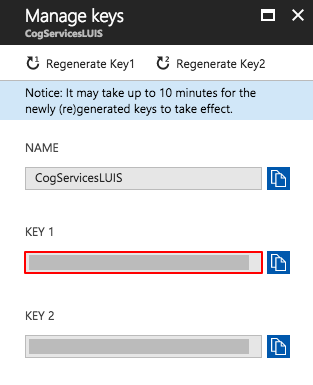

### LUIS Domain
 The `LUIS_DOMAIN` can also be obtained from the overview of your LUIS service in Azure. This is the endpoint listed in your LUIS Service overview i.e '_westcentralus.api.cognitive.microsoft.com_'

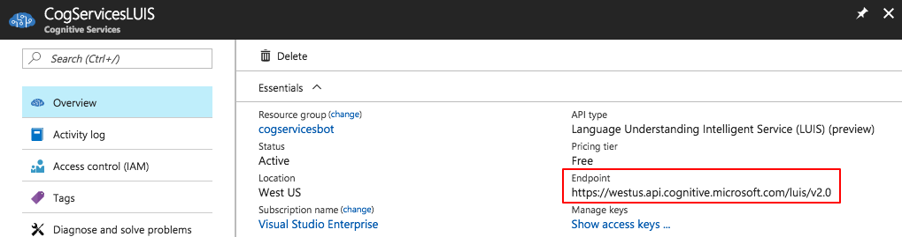

## Publishing Your Bot

### Bot Emulator
The Bot Framework Emulator is a desktop application that allows bot developers to test and debug their bots, either locally or remotely. Using the emulator, you can chat with your bot and inspect the messages that your bot sends and receives. The emulator displays messages as they would appear in a web chat UI and logs JSON requests and responses as you exchange messages with your bot.

To get started, you can download the Bot Framework Emulator here:
[https://docs.microsoft.com/en-us/bot-framework/debug-bots-emulator](https://docs.microsoft.com/en-us/bot-framework/debug-bots-emulator)

### Publishing Online
After you have built and tested your bot, you need to deploy it to the cloud for other people too use it. 


##### 1. Create a Bot Instance

Head to [dev.botframework.com](https://dev.botframework.com/bots) and create a new bot instance.


##### 2. Register an existing bot

We want to register an existing bot built using the Bot Builder SDK.


##### 3. Register an existing bot

Fill out the required information, don't worry about the 'Messaging endpoint' at the moment, we'll come back to that. 

Click the _'Create Microsoft App ID and password'_ button.


##### 4. Create a Microsoft App ID
Create the App ID and password.


Make sure you copy the new password and make a note of it somewhere then finalise the bot creation.


##### 4. Update the WebConfig

Return to the `WebConfig` file in the bot solution and update it with the new bot information.

```
<appSettings>
    <add key="BotId" value="[YOUR_BOT_ID]" />
    <add key="MicrosoftAppId" value="[APP_ID]" />
    <add key="MicrosoftAppPassword" value="[APP_PASSWORD]" />
    ...
  </appSettings>
```

##### 5. Create a new Web App
To host our new bot we're going to create a web app in Azure. Head over to the Azure portal and get started.


##### 6. Set the Bot's Messaging Endpoint

Use the URL listed in our newly created Web App to set the bots messaging endpoint back at [dev.botframework.com](https://dev.botframework.com/bots). Once the endpoint has been updated, click the Quickstart guide to deploy our code.


##### 7. Populate the Web App
From here you can choose how you want to get the code deployed to the Web App. Select the first ASP.NET option and follow the instructions to get the bot live!


### Finally
There are a number of alternative ways you can deploy your bot online. For more information you can read the documentation here:
[https://docs.microsoft.com/en-us/bot-framework/deploy-bot-overview](https://docs.microsoft.com/en-us/bot-framework/deploy-bot-overview)


***

# Summary
Finally we have our custom search bot up we can add additional channels for our users to communicate with the bot. Try configuring the bot in a number of different channels, to see how the bot behaves from the users point of view.


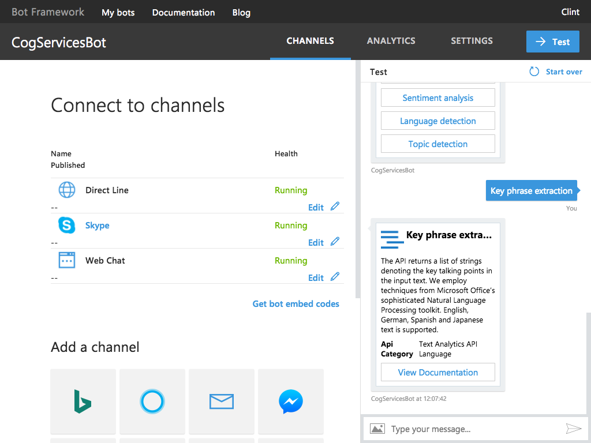

---
## Authors
- Clint Francis - [Github](https://github.com/clintfrancis)
