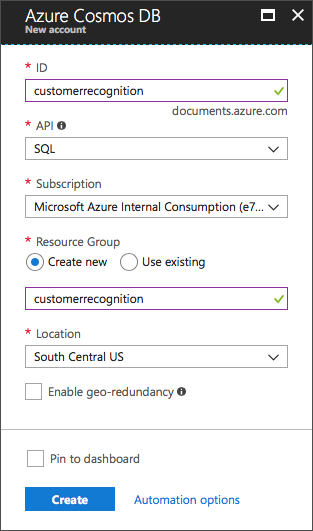
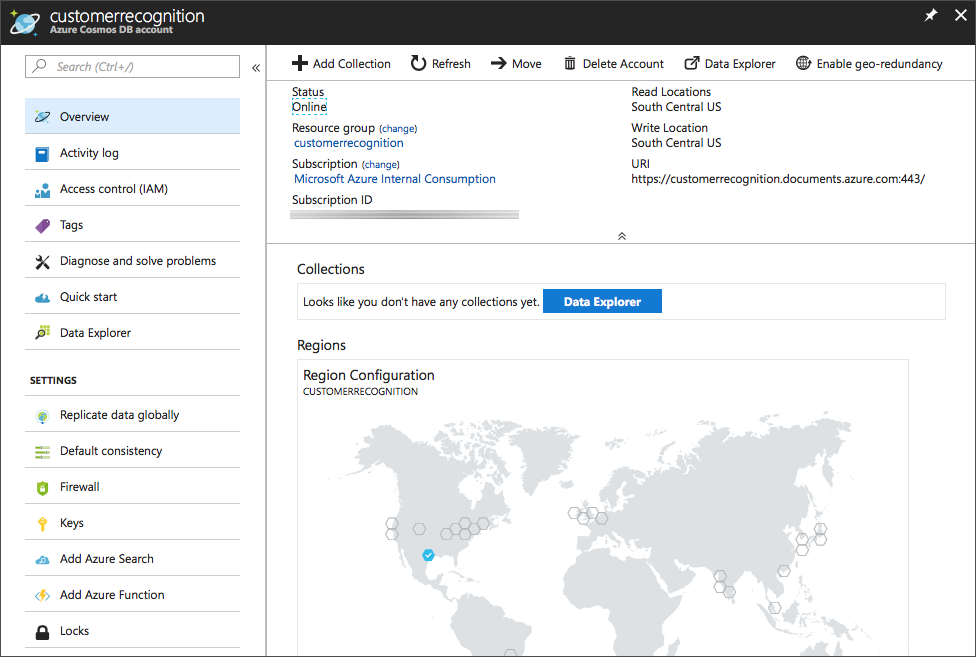
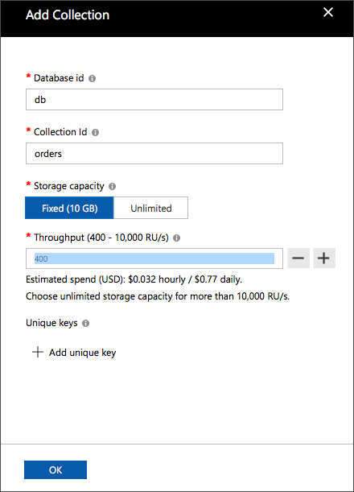

# Cosmos DataBase

## Database Setup - Cosmos DB

We're planning to use Cosmos DB to store all the information we need to identify users and store their orders. We're going to set up two different collections, one for our 'orders' and one for our 'customers'. We'll then be able to match any identified customers with their previous orders so that we can greet them by name and ask if they'd like their 'regular' order.

## Create a Cosmos DB database and collection
For this project we'll be using Cosmos DB for all our data storage (Orders and Customer entries).

### 1. Navigate to Cosmos DB in the Azure Portal

[https://azure.microsoft.com/en-gb/services/cosmos-db/](https://azure.microsoft.com/en-gb/services/cosmos-db/)

### 2. Create a Cosmos DB account  
Create a new account with a unique id, in this case I'll be using _'customerrecognition'_. Select the _'SQL'_ API and if needed create a new Resource Group. Then create the Cosmos DB account.

### 3. Create a new Databases (SQL)  
Click on _Add Collection_ to create a new Database

- Set a fixed storage capacity of 10GB
- Choose the lowest throughput capacity of 400 (Estimated hourly spend $0.032USD)
- Set the database id field to 'db'
- Set the collection id field to 'orders'
- Add another new collection to the 'db' database named 'customers'.

