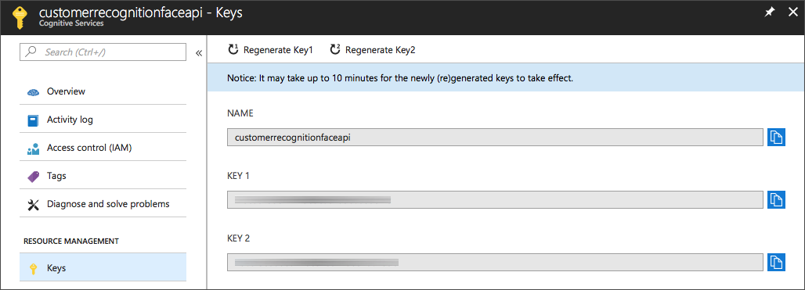
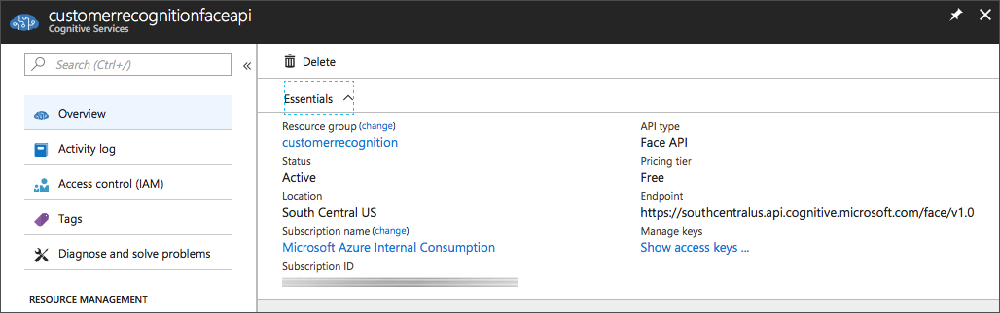
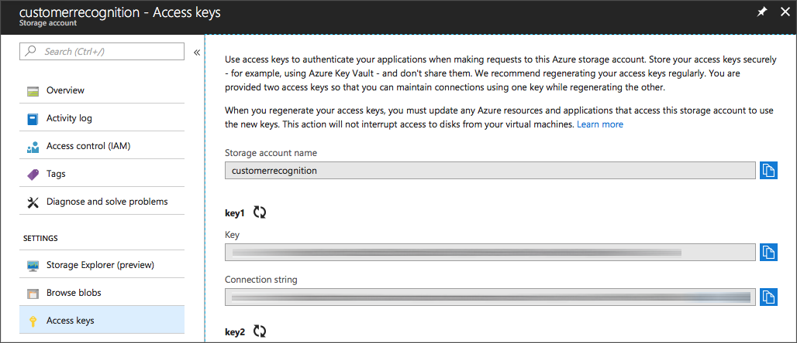
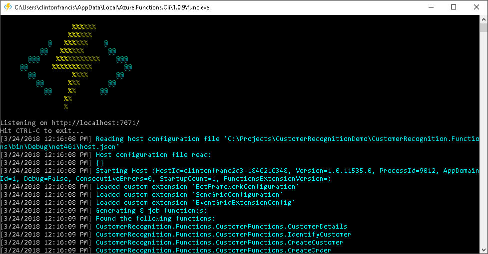

# Functions

## Setup Visual Studio

If you haven't already installed the Visual Studio Tools for Azure Functions you'll need to install them. They are available from the Visual Studio marketplace [here](https://marketplace.visualstudio.com/items?itemName=ms-azuretools.vscode-azurefunctions).


## Configuring

All the code that is required for the demo has been supplied, however we're need to configure the solution with data from our newly created Azure azure services.

### Environmental Properties

To set the environmental properties for the solution, double click on the solution's 'Properties' then navigate to:  

	Properties > Debug > Environmental Properties

### Face Api

Navigate to your Face Api account, from here you can find the values we need:

####	*FaceApiKey*

You can find the key for your account under "_Resource Management > Keys_". Copy Key 1 and set it as the `FaceApiKey` variable.




####	*FaceApiRegion*

You can find the url for your `FaceApiRegion` under "_Overview > Endpoint_". Copy it and set it as the `FaceApiRegion` variable.




### Azure Storage

Navigate to your Azure Storage account, from here you can find the value we need:

#### *StorageConnectionString*

You can find the Connection String under "_Settings > Access keys_". Copy it and set it as the `StorageConnectionString` variable.



### Cosmos DB

Navigate to your CosmosBD account, from here you can find the values we need:

#### *DocumentEndpointUri*

You can find the Uri under "_Settings > Keys_". Copy it and set it as the `DocumentEndpointUri` variable.
	


#### *DocumentAuthKey*

You can find the Primary Key under "_Settings > Keys_". Copy it and set it as the `DocumentAuthKey` variable.


## Testing Locally

An integral part of any development project is testing what you've written. As we're going to be testing the HTTP Trigger functions we've written we're going to need a tool to help us with making and managing our Api calls. 
 
 While writing this demo I used Postman to develop a collection of Api calls that would help me test my functions. I've included  this collection as part of source code so you can easily test each of the functions locally using Postman. Some of the methods in the Postman collection contain sample images that have been converted to unicode to make image recognition testing easier. 

#### Postman

An introduction to Postman is available to watch [here](https://www.youtube.com/watch?v=q78_AJBGrVw)

You can download Postman at [https://www.getpostman.com](https://www.getpostman.com)

The collection of test calls for this demo is included in the repository at:
  
	/Resources/CustomerRecognition.postman_collection.json

#### Testing
Once the environmental variables have been configured, we'll use Postman to test the project locally before publishing it to Azure. Make sure the the functions solution is set as the startup project and build it.

You will see a window displaying the `localhost` output:


<br/>
Once you have your `localhost` successfully running, open Postman and load the customer recognition collection included in the resources folder.

Because we're testing the Api's manually we're going to have to cut and past some values from the returned JSON to successfully create a new order. 

##### 1. Select _Identify Customer_

The first step is to identify a new customer as we don't have registered customers in the database yet. The _Identify Customer_ Api call already has an encoded image in the body of the post, so all you need to do is press *Send*.

##### 2. Copy the `FaceId` value from the body of JSON return.

Postman will display the JSON returned from the Api call in the bottom half of the screen. We're going to need two values from this return; FaceId and ImageUrl.

/images/6_07_Functions_Postman1.png

##### 3. Select _Create Order_

Select _Create Order_ and update the FaceId and CustomerImageUrl values with the response we received in the previous step.

```json
{
    "Customer": {
        "id": null,
        "FaceId": "%INSERT_TARGET_FACE_ID%",
        "PersonId": "00000000-0000-0000-0000-000000000000",
        "FirstName": "John",
        "LastName": "Smith",
        "Age": 29,
        "Gender": "male",
        "Anonymous": false
    },
    "Emotion": "Happiness",
    
    "Order": {
    	"Description":"coffee",
    	"Total":5,
    	"Emotion":"Happiness",
    	"CustomerImageUrl": "%INSERT_TARGET_FACE_URL%"
    }
}
```

Once the values have been updated, click 'Send' and you should receive a response like the one below.

```json
{
    "Order": {
        "id": "836a94d7-3a8d-4b4d-86c1-a230c2d84532",
        "CustomerId": "f7e0be4f-1ec2-4202-a0dd-0432726aeedf",
        "OrderNumber": 1,
        "Date": "0001-01-01T00:00:00",
        "Description": "coffee",
        "Total": 5,
        "Emotion": "Happiness",
        "Status": 0,
        "CustomerImageUrl": "https://identifycustomerstorage.blob.core.windows.net/faces/cea5cf9b-18dd-4e3b-af05-34a92544dbf0.png"
    },
    "Id": null,
    "RequestId": null,
    "StatusCode": 0,
    "ErrorCode": 0,
    "Message": "Order Created",
    "HasError": false
}
```

Of course its much easier to publish the app and use it to handle the process for us but this lets us test out the Api before we publish the functions project to Azure.

## Publishing to Azure

There are two ways you can publish the functions solution to Azure. You can use Visual Studio (windows only currently) or you can use an online code repository 

#### Visual Studio Guide
In Solution Explorer, right-click the project and select **Publish**. Choose **Select Existing** and then **Publish**. Select the Newley created Functions App and click **OK** and the functions app will start publishing.

#### Code Repository
There is a great online guide for linking your Functions app to an online repo available [here](http://www.tomsitpro.com/articles/deploy-azure-functions-best-practices,1-3586.html).