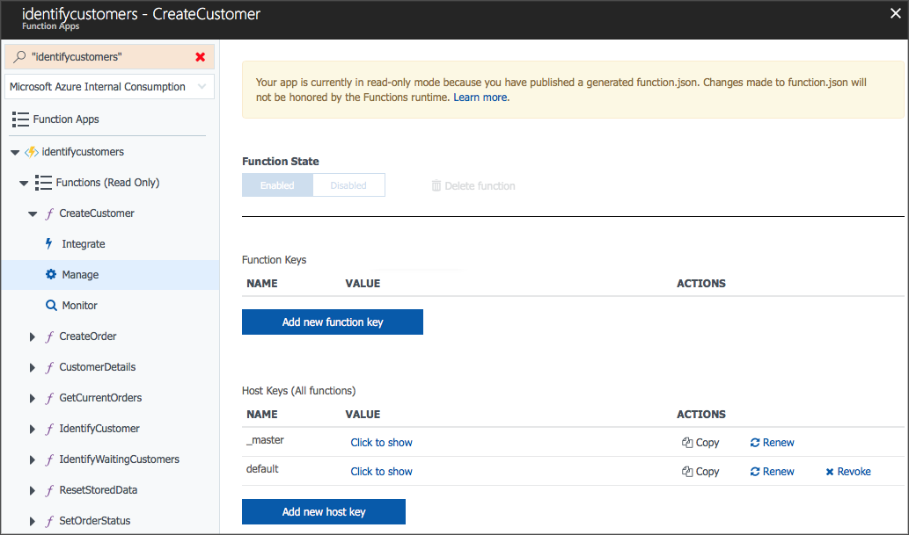

# Mobile Client

### Configuring

Once the functions have been published our Azure functions app we can configure our mobile client. Each of the functions hosted in Azure requires a key for access, so in order for the app to reach the functions we need to add the keys to our mobile solution.

In the `CustomerRecognition.Forms`project open the file 
`Constants\ProjectConfig.cs`.

Here you'll see a number of variables that will need updating.

#### BaseUrl
The `BaseUrl` requires the function app name:

	static string BaseUrl = "https://%FUNCTION_APP_NAME%.azurewebsites.net/api/";

#### Function Url's
Each of the function Url's require require their own Api key:

	CustomerDetailsUrl
	IdentifyCustomerUrl
	CreateCustomerUrl
	CreateOrderUrl
	GetCurrentOrdersUrl
	IdentifyWaitingCustomersUrl
	ResetGroupsUrl
	SetOrderStatusUrl

Add the function keys after `?code=` e.g:

	public static string CustomerDetailsUrl = BaseUrl + "CustomerDetails?code=%YOUR_API_KEY_HERE%";

You can find each of the Api keys in the Azure functions app under **FunctionName** \ **Manage**.

Once the keys are all updated, the app should be successfully connected to your Azure functions app.

## Xamarin.Forms

The app has been written to support iOS, Android and UWP.

Both the iOS and Android apps can be used to take orders and identify customers, current the UWP app is only used for identifying customers.

If you require help getting started with Xamarin or publishing the mobile apps, take a look at the introduction guides here:

[https://docs.microsoft.com/en-us/xamarin/](https://docs.microsoft.com/en-us/xamarin/)

### Notes

Android

- If running the app in the simulator, make sure you've set the simulator camera to use your existing system camera (if your computer does not have a webcam, you can set the camera choice to 'emulate').
- Android front facing camera is not implemented as of yet.

UWP

- Camera support implemented for rear facing cameras