This is a quick tutorial where we'll create and publish a new intelligent Bot that uses machine learning and natural language understanding to answer questions about Microsoft Bot Framework.  Then we'll create a native iOS and Android app to interact with our bot.  Let's get started!

 

### Setup: Accounts & Subscriptions

To get started, you'll need to create/login to a few accounts.  (don't worry, they're all free)

**Microsoft Azure**

We'll be using Azure Bot Service, so you'll need an Azure account. If you don't already have one, you can create a **free** Azure account [here][5].

**Microsoft Bot Framework**

[Create or login][4] to your [Microsoft Bot Framework][3] account. Even if you already have an account, make sure to login, as it'll simplify setting up your bot in Azure.

**QnA Maker**

[Create or login][2] to your [QnA Maker][1] account. Even if you already have an account, make sure to login, as it'll simplify setting up your bot in Azure.

 
  

# Azure Bot Service

Next, we'll use Azure Bot Service to build our bot.

## Create an Azure Bot Service

Click [here][8] to create a new Azure Bot Service resource in the Azure portal  

`App name`: This will be your bot's default name, and the first part of your bot's url  
`Subscription`: Choose the subscription you want to use from the drop-down  
`Resource Group`: Leave "Create new" selected, and leave the value the same as _App name_  
`Location`: Choose the location that best describes your current location  
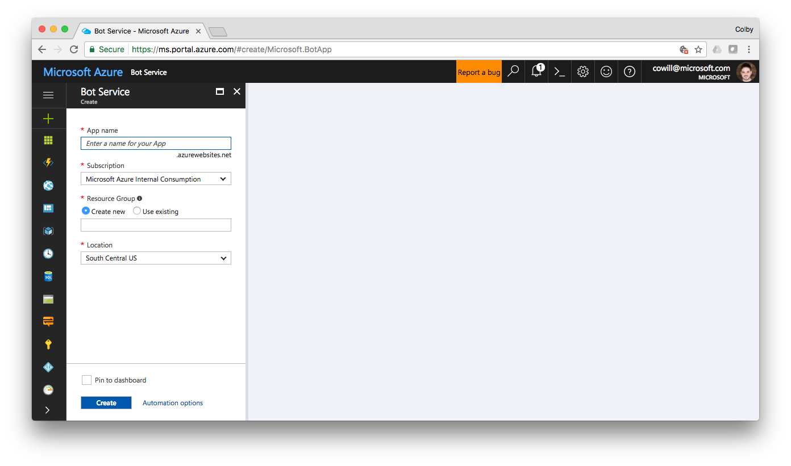  
Click **Create** to create and deploy your new Azure Bot Service.

## Configure your bot

Once your bot is finished deploying, open it in the Azure portal.  You can click [here][9] to see a list of your resources where you'll find your new Azure Bot Service.  
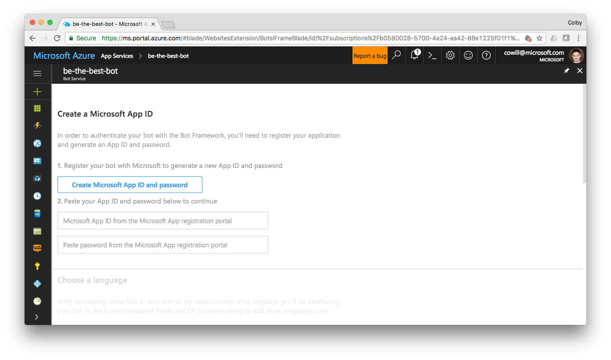  
Click **Create Microsoft App ID and password**  
  
##### _This should open a new tab displaying your new App name and App ID. (If you're prompted to login, make sure you login with the same email address you used to create your Microsoft Bot Framework account)._

Next, click **Generate App ID and password** to show a pop-up displaying your new password.  Copy the password to your clipboard and click **Ok**.  

_**Make sure to store the password somewhere safe now as you will not be able to see it again.**_  

Click **Finish and go back to Bot Framework**. This should close the tab and return you to the Azure portal with new App ID already be filled in.  
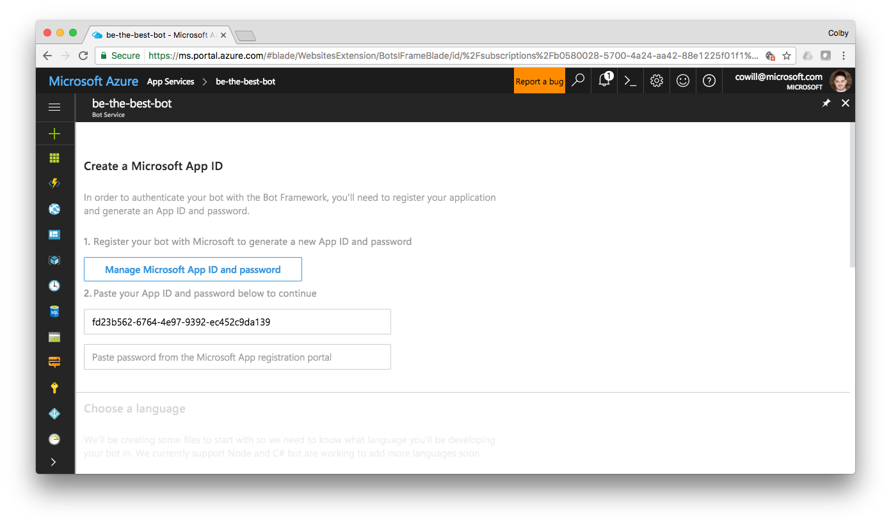  
**Paste** your new App password into the password field. Then, under **Choose a language**, select the language to write your bot in.  
##### _Note: I'll be using C#, but you should be able to complete this sample using NodeJS as well._  

Choose the **Question and Answer** template under **Choose a template**, agree to the _Terms of Use, Privacy Statement, and Code of Conduct for the Microsoft Bot Framework (Preview)_, and click **Create bot**.  
##### _You should be presented with a pop-up dialog to **Connect Azure Bot Service to QnA Maker**.  If not, make sure you're logged in to your QnA Maker account, and you're not blocking the associated cookies_
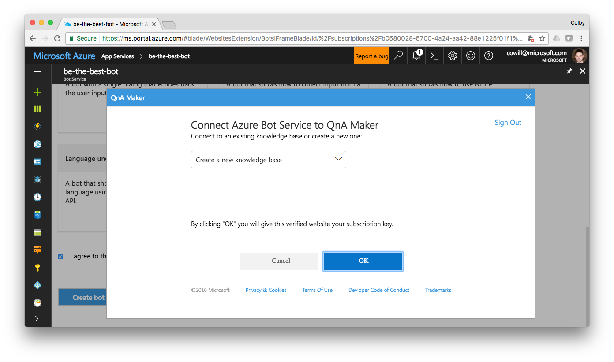  
Leave (or select) **Create new knowledge base** selected in the drop-down menu and Click **OK**.  You should see a green banner across the top of the Azure portal letting your know your bot is being provisioned.  
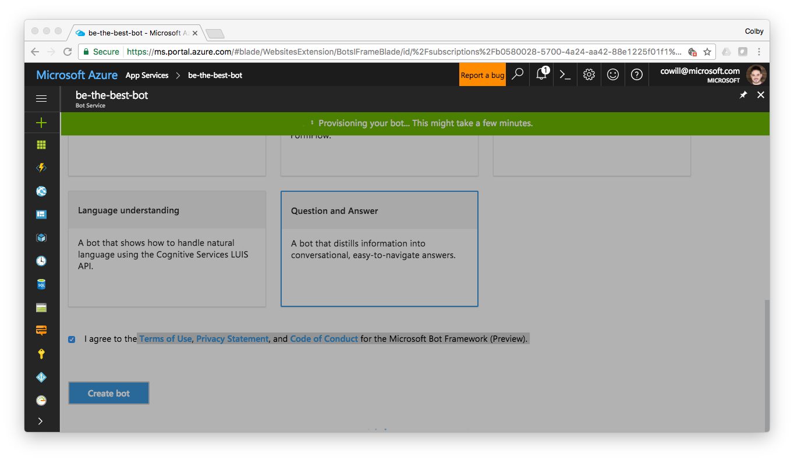

## Train your QnA service

Now that your bot is set up and pointing to a new QnA service, we'll need to teach the QnA service some, well... questions and answers.

Click [here][10] to view a list of your QnA services, and select edit icon next to the service you just created. It'll likely be name something like _"Basic QnA KB-2017-05..."_.  
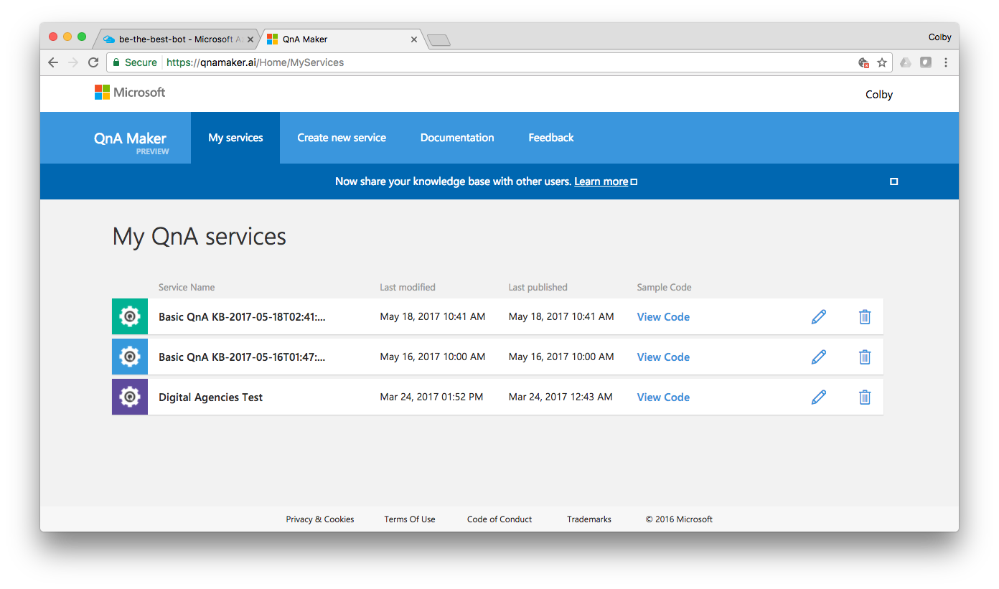  
On the left hand side of the dashboard, select **Settings**  
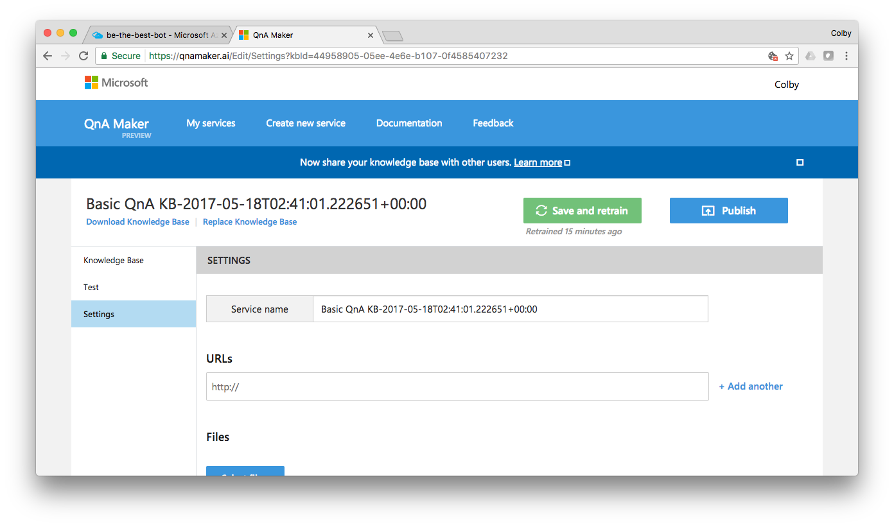  
Paste the following urls into the **URLs** section. (_Note: you're free to use any FAQ urls you want, it won't prevent you from completing this sample)_
- https://docs.microsoft.com/en-us/bot-framework/resources-bot-framework-faq
- https://docs.microsoft.com/en-us/bot-framework/troubleshoot-general-problems

  
Click **Save and retrain**, then click **Publish**. You'll be presented with a screen showing the changes to your services knowledge base that will be published.  
  
Click **Publish**.  

## Test your bot

Return to your Azure Bot Service in the Azure portal and click **Test** in the top right to open a web chat with your bot.
- Type `Hi` in the chat window and press return
- Type `What's the Direct Line channel?` and press return

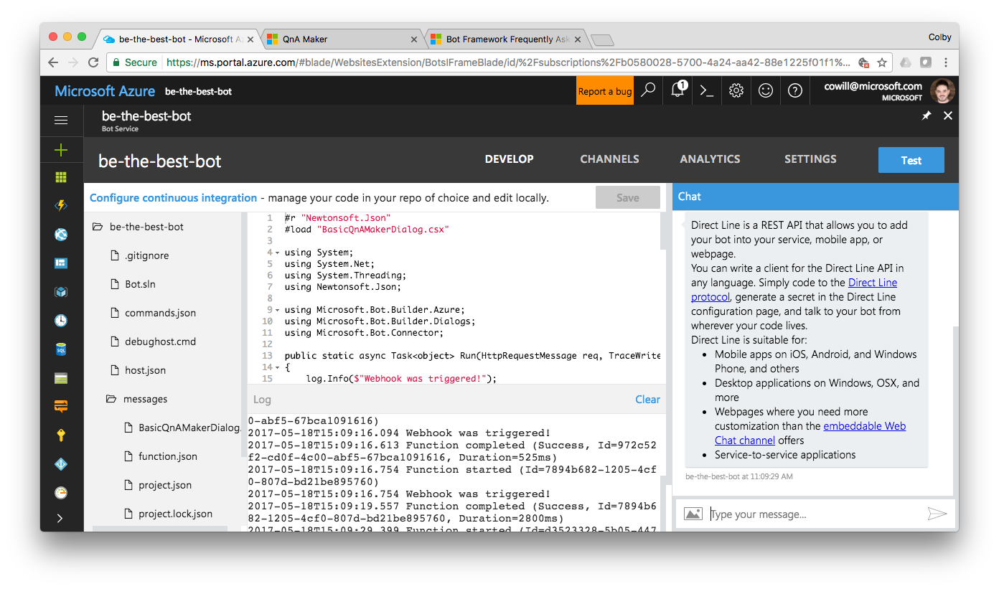  

 

# Create a Native Mobile App

_To complete this step you'll need to have Visual Studio for Mac.  You can download and install it [here][11]._

Now we'll create a native iOS and Android app to interact with our bot. I've created a custom Project Template for Visual Studio that sets everything up automatically. We'll set that up first.

## Install NomadCode.ProjectTemplates extension

Here's how to install NomadCode.ProjectTemplates:

1. Download the `.mpack` file under the Downloads section of the [latest release of NomadCode.ProjectTemplates][12]
2. Launch Visual Studio for Mac, open the _**Visual Studio**_ menu and select _**Extensions...**_
3. In the bottom left of the _Extension Manager_ dialog, click **Install from file...**
4. Choose the `.mpack` file you downloaded in step 1
5. When prompted, select **Install**
6. Once installation is complete, click "Ok" and close the _Extension Manager_ dialog

## Create new App

Now we'll create our mobile app solution.

In Visual Sudio for Mac, got to _**File**_ -> _**New Solution...**_ (or Shift + ⌘ + N).  Then, in the _New Solution_ dialog's left column, select **App** (under Multiplatform) then **Native Bot (iOS, Android)** and click **Next**.
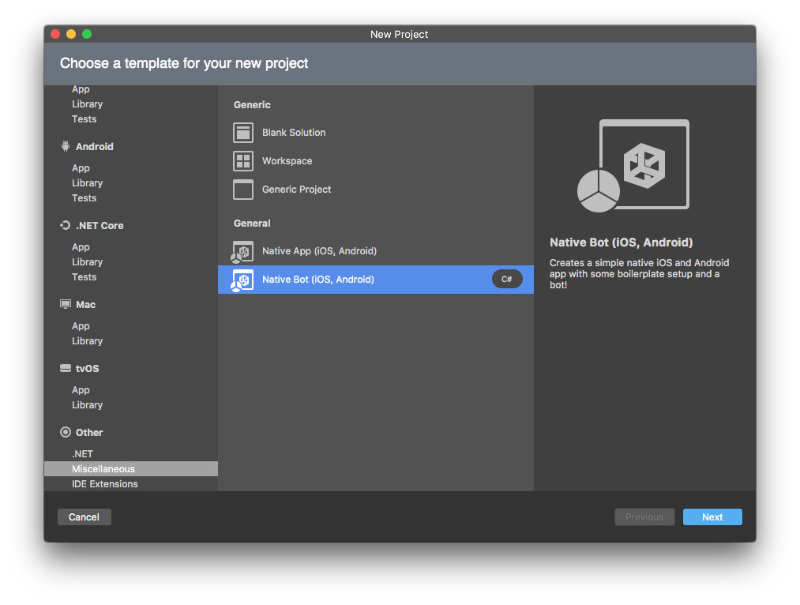
##### Note: Depending on the version of Visual Studio for Mac, this project type may be under _Other -> Miscellaneous -> General_ instead
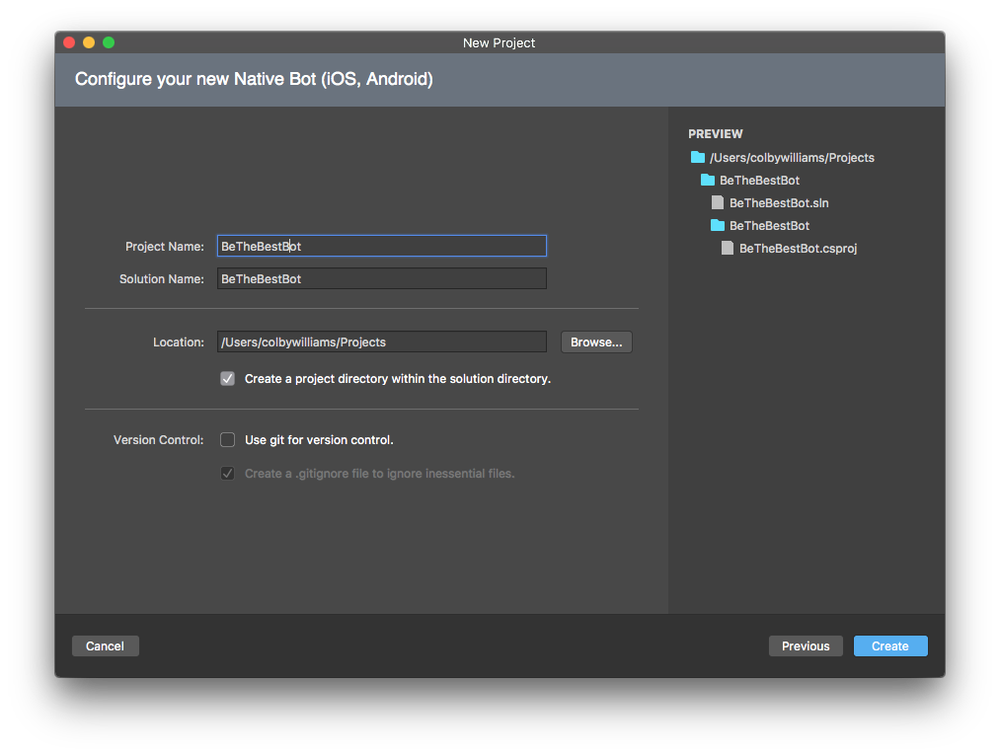  
Finally name your project, choose a location, and click **Create**.

## Enable Direct Line channel

Your app will communicate with your bot via the Direct Line channel, so we'll need to enable that back in the Azure portal.

Return to your Azure Bot Service in the Azure portal, and click **CHANNELS** in the top right to configure the channels your bot supports.
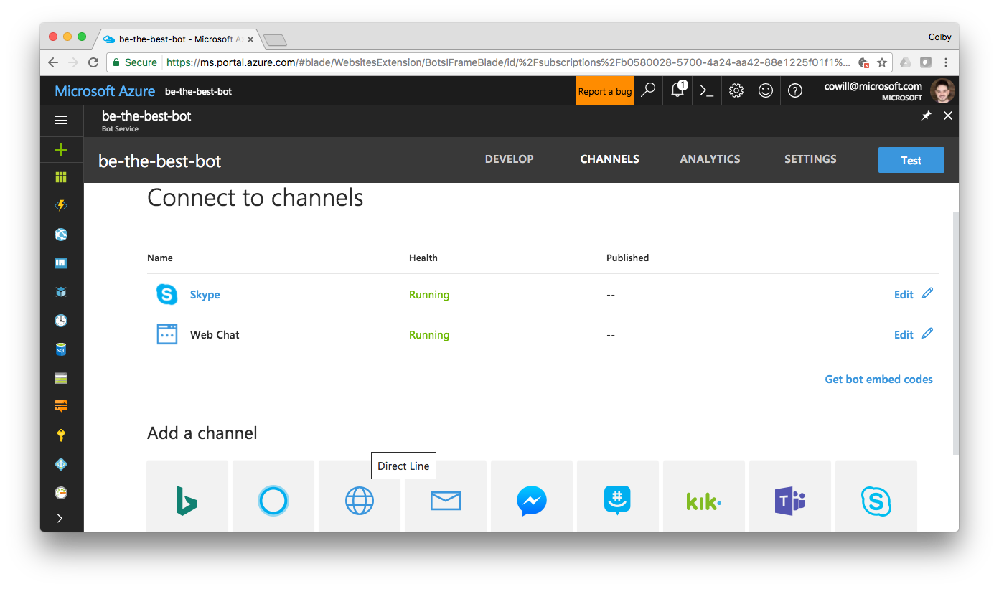
Under the **Add a channel** section, select the **Direct Line** channel.
##### This should open a new tab to _Configure Direct Line_. If it does not, make sure you're logged in to your Microsoft Bot Framework account, and you're not blocking the associated cookies.
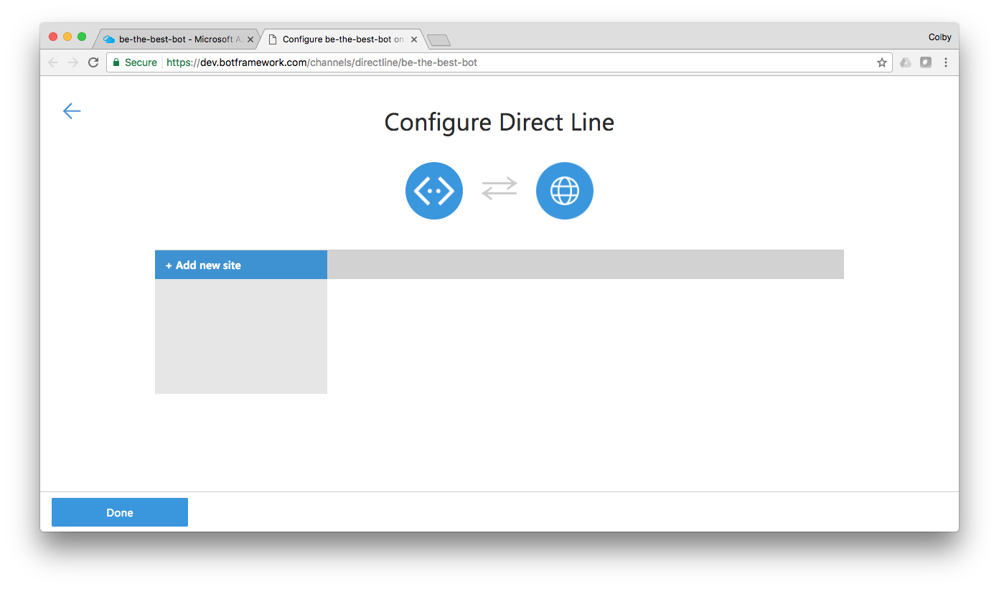
On the _Configure Direct Line_ page, click **+ Add new site** in the left column and enter `Mobile App into the **Name your site** field and click **Done**.  
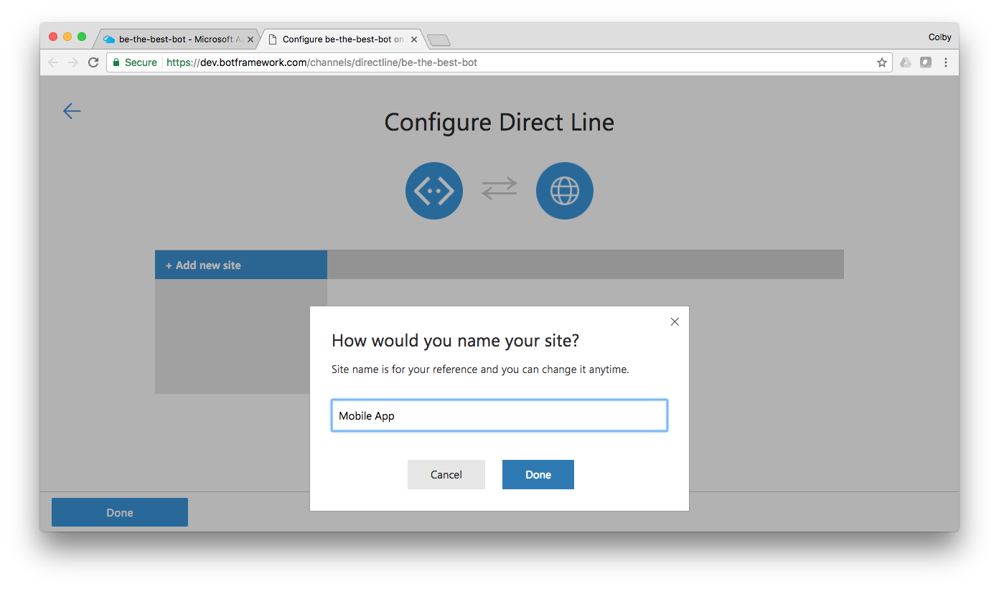  
You should now see two **Secret keys**. Click **Show** next to one of the keys, **Copy the key to your clipboard**, then click **Done**  
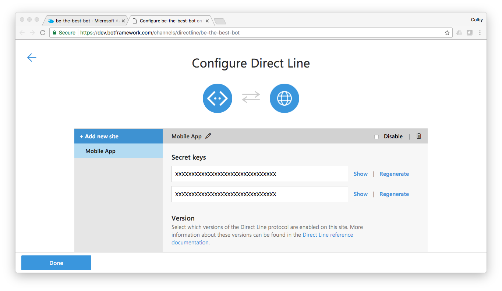

## Add Direct Line Secret to  Mobile App

Now that we have the secret, return to Visual Studio for Mac and open (if it's not already) the app solution we created earlier.  

In the Solution Explorer open the `Keys.cs` located in the `Keys` directory of the Shared project, and paste in the Direct Line secret for the value of `DirectLineSecret` on `line 16`.
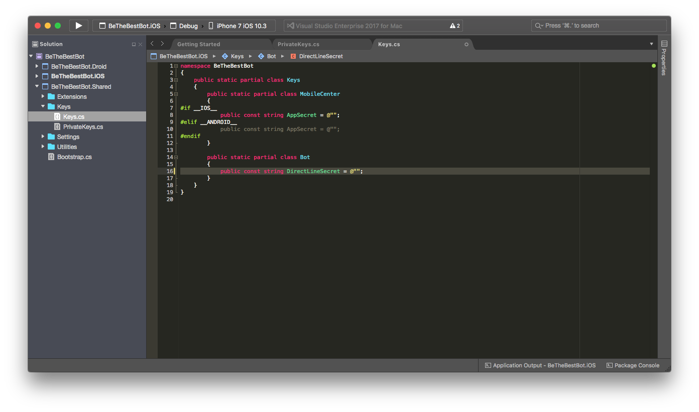

## Build and Run the App

Finally, build and run the app on the iOS Simulator and interact with your bot:
- Type `Hi` in the chat window and press return
- Type `What's the Direct Line channel?` and press return  

[0]:https: //github.com/colbylwilliams/NomadCode.ProjectTemplates
[1]:https://qnamaker.ai/
[2]:https://qnamaker.ai/Account/SignIn
[3]:https://dev.botframework.com/
[4]:https://dev.botframework.com/login?requestUrl=%2F
[5]:https://azure.microsoft.com/free/
[6]:https://portal.azure.com/
[7]:https://azure.microsoft.com/
[8]:https://ms.portal.azure.com/#create/Microsoft.BotApp
[9]:https://portal.azure.com/#blade/HubsExtension/Resources/resourceType/Microsoft.Web%2Fsites
[10]:https://qnamaker.ai/Home/MyServices
[11]:https://www.visualstudio.com/vs/visual-studio-mac/
[12]:https://github.com/colbylwilliams/NomadCode.ProjectTemplates/releases/latest
